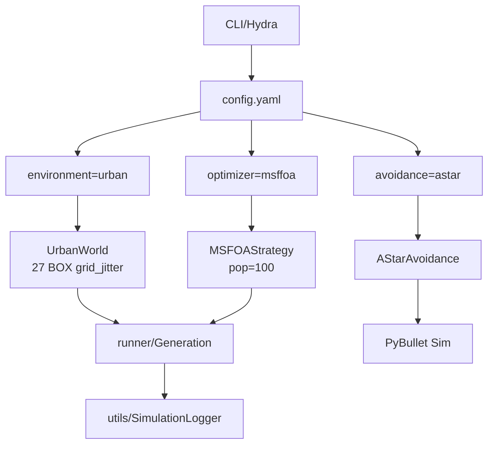

# configs/ — Konfiguracja Hydra (modularna)

Struktura **Hydra 1.3** z **hierarchią override'ów** dla eksperymentów. Umożliwia **grid search** algorytmów/środowisk jednym CLI.

## 🏗️ Struktura

```
configs/
├── config.yaml                 # Bazowa
├── avoidance/                  # Strategie online
│   ├── astar.yaml       # A* local
│   ├── none.yaml        # No avoidance
│   ├── msffoa.yaml
│   ├── nsga-3.yaml
│   ├── ooa.yaml 
│   └── ssa.yaml 
├── environment/                # Świat + przeszkody
│   ├── empty.yaml
│   ├── forest.yaml
│   ├── urban.yaml 
│   └── strategies/
│       └── placement_strategies.py
└── optimizer/                  # Optymizatory offline
    ├── msffoa.yaml 
    ├── nsga-3.yaml 
    ├── ooa.yaml
    └── ssa.yaml
```

## 🎯 config.yaml — Master template

**Sekcje**:
```yaml
# Hydra dispatch
environment:  # environments/
optimizer:    # optimizer/
avoidance:    # avoidance/
runner:       # runner/
sim:          # PyBullet params
logger:       # utils/SimulationLogger
```

## 🌍 environment/ — Scenariusze

| YAML | Typ | Przeszkody | Tunele | Start→End |
|------|-----|------------|--------|-----------|
| **`empty.yaml`** [file:41] | Pusty | 0 | Konfig | Testy |
| **`forest.yaml`** [file:42] | Las | **17 CYLINDER** | 60×600×11m | [20-40,5→595,1.5→2.5] |
| **`urban.yaml`** [file:40] | Miasto | **27 BOX** | 300×1000×20m | [145-165,5→995,5m] |

**Wspólne**:
```yaml
_target_: src.environments.XXX
drone_model: "CF2X"
num_drones: 5
track_length/width/height
shape_type: 'CYLINDER/BOX'
placement_strategy: 'strategy_random_uniform/grid_jitter'
obstacles_number: 17/27
safe_radius: 15/30m
initial_xyzs/end_xyzs: 5×[x,y,z]
```

**placement_strategies.py**: `get_placement_strategy(name)` → funkcje generujące.

## 🧬 optimizer/ — Algorytmy offline

| Algorytm | YAML | Populacja | Generacje | Specyfika |
|----------|------|-----------|-----------|-----------|
| **MSFOA** | `msffoa.yaml` | 100 | 500 | Multi-swarm FOA |
| **NSGA-III** | `nsga-3.yaml` | 50 | 300 | Wiele celów |
| **SSA** | `ssa.yaml` | 80 | 400 | Sparrow Search |
| **OOA** | `ooa.yaml` | 120 | 600 | Osprey hunting |

**Przykłady**:
```yaml
# msffoa.yaml
_target_: src.algorithms.abstraction.strategies.core_msffoa
population_size: 100
max_generations: 500
number_of_swarms: 5
```

## 🛡️ avoidance/ — Online strategie

| Strategia | YAML |
|-----------|------|
| **`none.yaml`** [file:39] | Brak |
| **`astar.yaml`** [file:38] | 3D A* grid |
| **`msffoa/nsga-3/ooa/ssa`** | Hybrydy z offline |

## 🚀 Użycie CLI (grid search)

```bash
# Pojedynczy
python main.py environment=urban optimizer=msffoa

# Override
python main.py environment=forest+num_drones=10

# Sweep (Hydra-multirun)
python main.py environment=urban,forest optimizer=msffoa,nsga-3

# Replay
python main.py --replay results/2026-04-21_urban_msffoa/
```

## 📊 Przykładowe urban.yaml

```yaml
_target_: src.environments.UrbanWorld
name: "urban"
params:
  num_drones: 5
  track_length: 1000.0     # Y [m]
  track_width: 300.0       # X [m]
  shape_type: 'BOX'
  placement_strategy: 'strategy_grid_jitter'
  obstacles_number: 27
  safe_radius: 30.0
initial_xyzs: [[145-165, 5, 5]]  # Parallel corridors
end_xyzs: [[145-165, 995, 5]]
```

## 🔄 Diagram Hydra dispatch

