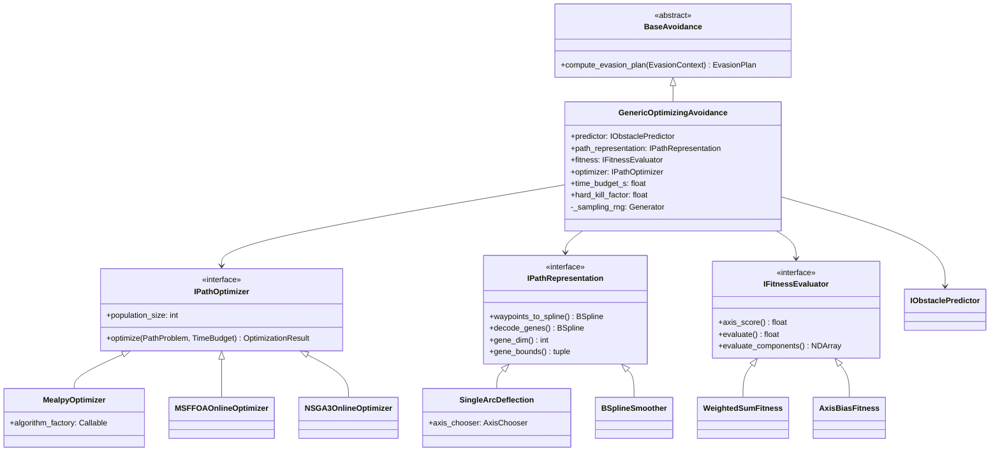

# src/algorithms/ — Algorytmy optymalizacji trajektorii roju dronow

Katalog implementuje algorytmy planowania trajektorii roju UAV w dwoch
fazach: **offline** (optymalizacja globalna waypointow) i **online**
(reaktywne unikanie przeszkod w czasie lotu). Cztery bio-inspirowane
meta-heurystyki (MSFOA, OOA, SSA, NSGA-III) sa porownywane w obu fazach
przy zachowaniu warunku **ceteris paribus** — wspolny evaluator,
inicjalizacja, budzet obliczeniowy.

## Struktura

```
src/algorithms/
├── SwarmFlightController.py           # Kontroler sledzacy trajektorie + online avoidance
├── abstraction/
│   └── trajectory/
│       ├── objective_constrains.py    # VectorizedEvaluator: 5 celow + 3 ograniczen
│       ├── Optimization logic.md      # Dokumentacja formulacji optymalizacyjnej
│       └── strategies/
│           ├── nsga3_swarm_strategy.py    # NSGA-III (pymoo MOO)
│           ├── msffoa_strategy.py         # MSFOA (custom SOO)
│           ├── ooa_strategy.py            # OOA (mealpy SOO)
│           ├── ssa_strategy.py            # SSA (mealpy SOO)
│           ├── soo_adapter.py             # TrajectorySOOAdapter (MOO->SOO bridge)
│           ├── core_msffoa.py             # Rdzen MSFOA (Shi et al. 2020)
│           ├── timing_utils.py            # TimingCollector per etap
│           ├── nsga3_utils/
│           │   └── decision_maker.py      # MCDM: Equal / Safety / KneePoint
│           ├── shared/
│           │   ├── bspline_utils.py       # Numba B-spline: ewaluacja + rekonstrukcja
│           │   ├── StraightLineNoiseSampling.py   # Wspolna inicjalizacja populacji
│           │   └── NumbaTrajectoryProfile.py      # Profil kinematyczny (numba JIT)
│           └── docs/
│               ├── MSFFOA-literature-differences.md
│               ├── OOA-literature-differences.md
│               └── SSA-literature-differences.md
└── avoidance/
    ├── BaseAvoidance.py               # ABC: compute_evasion_plan -> EvasionPlan
    ├── GenericOptimizingAvoidance.py   # Kompozycja 4 sub-strategii + budzet czasu
    ├── interfaces.py                  # 4 ABC: IObstaclePredictor, IPathRepresentation,
    │                                  #         IFitnessEvaluator, IPathOptimizer
    ├── budget.py                      # TimeBudget (cooperative) + hard_deadline (SIGALRM)
    ├── EvasionContextBuilder.py       # Preprocesor: rejoin point, search bbox
    ├── predictors/
    │   └── ConstantVelocityPredictor.py   # IObstaclePredictor: liniowa ekstrapolacja
    ├── path/
    │   ├── SingleArcDeflection.py     # IPathRepresentation: magnitude + peak_pos -> BSpline
    │   ├── AxisChooser.py             # Deterministyczny wybor osi uniku (right/left/up/down)
    │   ├── BSplineSmoother.py         # IPathRepresentation: waypointy -> BSpline (legacy)
    │   └── _jit_kernels.py            # Numba: resample, fallback, tangent_leads, space_in_xy
    ├── fitness/
    │   ├── WeightedSumFitness.py      # IFitnessEvaluator: w_safety + w_energy + w_jerk + w_symmetry
    │   └── AxisBiasFitness.py         # IFitnessEvaluator: bias osiowy (legacy)
    ├── optimizers/
    │   ├── MealpyOptimizer.py         # IPathOptimizer: generyczny adapter mealpy (SSA/OOA)
    │   ├── MSFFOAOnlineOptimizer.py   # IPathOptimizer: MSFOA (Eq. 7-19) na genach deflection
    │   └── NSGA3OnlineOptimizer.py    # IPathOptimizer: pymoo NSGA-III multi-obj (4 skladniki)
    └── ThreatAnalyzer/
        └── ThreatAnalyzer.py          # LiDAR hits -> ThreatAlert + EvasionContext
```

## Strategie offline (`abstraction/trajectory/strategies/`)

Globalna optymalizacja trajektorii dla calego roju. Wspolna formulacja:
**5 celow** (f1 trajectory\_cost, f2 height\_angle\_cost, f3 threat\_cost,
f4 turn\_cost, f5 coordination\_cost) i **3 ograniczenia** (obstacle collision,
swarm collision, kinematic penalty). Szczegoly formulacji:
`abstraction/trajectory/Optimization logic.md`.

| Strategia | Algorytm | Typ | Mechanizm selekcji | Reference |
|-----------|----------|-----|---------------------|-----------|
| `nsga3_swarm_strategy.py` | **NSGA-III** | MOO | Niedominacja + Das-Dennis ref. dirs (5 obj) | Deb & Jain (2014) |
| `msffoa_strategy.py` | **MSFOA** | SOO (skalaryzacja) | Multi-swarm + roulette | Shi et al. (2020) |
| `ooa_strategy.py` | **OOA** | SOO (mealpy) | Osprey hunting/fishing | Dehghani & Trojovsky (2023) |
| `ssa_strategy.py` | **SSA** | SOO (mealpy) | Sparrow producer/scrounger | Xue & Shen (2020) |
| `soo_adapter.py` | **TrajectorySOOAdapter** | Bridge MOO->SOO | F\_norm @ weights + weakest-link penalty | — |

### Ceteris paribus (offline)

- **Wspolny evaluator**: `VectorizedEvaluator` (5F + 3G) identyczny
  dla NSGA-III i SOO strategii. SOO strategie uzywaja `TrajectorySOOAdapter`
  do konwersji F/G na skalar.
- **Wspolna inicjalizacja**: `StraightLineNoiseSampling` z anizotropowym
  szumem (`noise_std_xy=2.0`, `noise_std_z=0.3`). Determinizm przez
  `SeedRegistry.rng("sampling")`.
- **Wspolny budzet**: Stale `n_gen` generacji (identyczne dla pymoo
  i mealpy). Seed optymalizatora z `SeedRegistry.seed("optimizer")`.
- **Wspolna historia**: `OptimizationHistoryWriter` zapisuje h5 per generacja
  (F, X, feasibility, CV, elapsed\_s, NFE).

### TrajectorySOOAdapter — Golden Rules

1. **Normalizacja celow** (Golden Rule #1): `F_norm = F / F_ref`, gdzie
   `F_ref` obliczone z ewaluacji trajektorii liniowej start->cel. Sprowadza
   5 celow do bezwymiarowej skali ~1.0.
2. **Weakest-link penalty** (Golden Rule #2): `penalty = penalty_weight *
   max(max(0, G))`. Najgorsze pojedyncze naruszenie ograniczenia dominuje
   fitness — jedno katastrofalne naruszenie nie moze byc rozcienione.

### Decision making (NSGA-III)

Po zakonczeniu optymalizacji, `decision_maker.py` wybiera jedno rozwiazanie
z frontu Pareto:

| Tryb | Logika |
|------|--------|
| `equal` | Min srednia znormalizowanych celow (Min-Max scaling) |
| `safety` | Hierarchicznie: (1) odrzuc f3 > 0, (2) min f1 z pozostalych |
| `knee_point` | Min odleglosc do utopia point w znormalizowanej przestrzeni |

Reference: Deb & Gupta (2011).

## Unikanie przeszkod online (`avoidance/`)

Architektura **Strategy + Composition** — `GenericOptimizingAvoidance`
komponuje 4 wymienialne sub-strategie instancjowane przez Hydre:

### 4 interfejsy (`interfaces.py`)

| Interfejs | Rola | Implementacje |
|-----------|------|---------------|
| `IObstaclePredictor` | Predykcja pozycji przeszkody w przyszlosci | `ConstantVelocityPredictor` (liniowa ekstrapolacja) |
| `IPathRepresentation` | Konwersja genow/waypointow na BSpline | `SingleArcDeflection` (aktualny), `BSplineSmoother` (legacy) |
| `IFitnessEvaluator` | Funkcja kosztu trajektorii uniku | `WeightedSumFitness` (4 skladniki), `AxisBiasFitness` (legacy) |
| `IPathOptimizer` | Silnik optymalizujacy sciezke w budzetcie czasu | `MealpyOptimizer`, `MSFFOAOnlineOptimizer`, `NSGA3OnlineOptimizer` |

### Konfiguracja avoidance (`configs/avoidance/`)

| Yaml | Algorytm | Optimizer | Path repr | Fitness |
|------|----------|-----------|-----------|---------|
| `ssa.yaml` | **SSA** (Sparrow Search) | `MealpyOptimizer(OriginalSSA)` | `SingleArcDeflection` | `WeightedSumFitness` |
| `ooa.yaml` | **OOA** (Osprey) | `MealpyOptimizer(OriginalOOA)` | `SingleArcDeflection` | `WeightedSumFitness` |
| `msffoa.yaml` | **MSFOA** (Multi-swarm Fruit Fly) | `MSFFOAOnlineOptimizer` | `SingleArcDeflection` | `WeightedSumFitness` |
| `nsga-3.yaml` | **NSGA-III** (referencyjny) | `NSGA3OnlineOptimizer` | `SingleArcDeflection` | `WeightedSumFitness` (multi-obj) |
| `none.yaml` | Brak avoidance | — | — | — |

Wszystkie 4 ewolucyjne yamle dziela ta sama strukture (predictor +
path\_representation + fitness) — roznia sie TYLKO sekcja `optimizer`.

### SingleArcDeflection — path representation

Aktualna reprezentacja sciezki uniku. Geny: `(magnitude, peak_position)` per
waypoint wewnetrzny — wymuszaja geometrie single-hump (jednolukowa defleksja)
po osi wybranej przez `AxisChooser`. Deterministyczny wybor osi
(right/left/up/down) na podstawie: clearance, anty-threat bias, secondary
blocking score.

### WeightedSumFitness — 4 skladniki

| Skladnik | Waga (domyslna) | Interpretacja |
|----------|-----------------|---------------|
| `c_safety` | `w_safety` | Minimalna odleglosc do predykowanej przeszkody |
| `c_energy` | `w_energy` | Dlugosc luku (proxy energii) |
| `c_jerk` | `w_jerk` | Gladkosc (krzywizna B-spline) |
| `c_symmetry` | `w_symmetry` | Odchylenie od osi preferowanej |

SOO: `fitness = w_safety * c_safety + w_energy * c_energy + ...`
NSGA-III: `evaluate_components()` zwraca wektor `[c_safety, c_energy, c_jerk, c_symmetry]`.

### Ceteris paribus (online)

`GenericOptimizingAvoidance` zapewnia warunek ceteris paribus dla
online optimizerow:

1. **Pre-generacja populacji**: `U(lb, ub)` ze wspolnego
   `np.random.default_rng(sampling_seed)` — identyczna sekwencja
   niezaleznie od backendu PRNG (mealpy PCG64, pymoo MT19937, custom MSFOA).
2. **PathProblem.initial\_population**: przekazywane do optimizera
   przez `PathProblem` dataclass. Kazdy trigger dostaje inna (ale
   deterministyczna) populacje.
3. **Wspolny budzet**: `TimeBudget` (cooperative) + SIGALRM `hard_deadline`
   (circuit breaker).

### Budzet czasu

| Mechanizm | Rola | Wartosc domyslna |
|-----------|------|------------------|
| `TimeBudget` (cooperative) | Primary — optimizer sprawdza `budget.check_or_raise()` w hot-loop | `time_budget_s = 1.0 s` |
| `hard_deadline` (SIGALRM) | Outer circuit breaker — odpala sie gdy cooperative zawiedzie | `time_budget_s * hard_kill_factor = 1.5 s` |

### Pipeline online avoidance

```
SwarmFlightController
    → LidarSensor.batch_ray_test() → list[LidarHit]
    → ThreatAnalyzer → ThreatAlert + EvasionContext
    → EvasionContextBuilder (rejoin point, search bbox)
    → GenericOptimizingAvoidance.compute_evasion_plan()
        → IObstaclePredictor.predict_state()
        → pre-generacja populacji (ceteris paribus)
        → IPathOptimizer.optimize(PathProblem, TimeBudget)
            → IPathRepresentation.decode_genes() → BSpline candidate
            → IFitnessEvaluator.evaluate() → scalar fitness
        → IPathRepresentation.waypoints_to_spline() → EvasionPlan
    → SwarmFlightController: evasion spline tracking → MODE_REJOIN_BLEND → TRACKING
```

## SwarmFlightController

Glowny kontroler lotu roju — integruje sledzenie trajektorii offline
z online avoidance. Maszyna stanow per dron:

| Tryb | Opis |
|------|------|
| `MODE_TRACKING` (0) | Sledzenie trajektorii bazowej (offline) przez PID |
| `MODE_EVASION` (1) | Sledzenie spline'u uniku z `EvasionPlan` |
| `MODE_REJOIN_BLEND` (2) | Mostek evasion -> tracking (mieszanie komend PID) |

### Mechanizmy ochronne

- **Evasion cooldown**: minimalny czas miedzy triggerami (`evasion_cooldown`, domyslnie 1.0 s)
- **Imminent replan throttle**: `imminent_replan_min_dt` (domyslnie 1.5 s) —
  zapobiega flip-floppingowi w korytarzach z wieloma przeszkodami
- **Lateral progress gate**: `lateral_progress_min_m` (domyslnie 1.0 m) —
  tlumi re-trigger jesli biezacy plan juz dziala (dron odlecial od trasy bazowej)
- **Sticky axis**: replany dziedzicza os z poprzedniego planu (zapobiega
  up/right/left flip-flop)

## Diagram Strategy Pattern (avoidance online)



## Uzycie

```bash
# Offline: optymalizacja trajektorii (rozne algorytmy)
python main.py environment=forest optimizer=nsga-3
python main.py environment=urban optimizer=msffoa

# Online: porownanie 4 algorytmow avoidance
python main.py environment=urban avoidance=ssa
python main.py environment=urban avoidance=ooa
python main.py environment=urban avoidance=msffoa
python main.py environment=urban avoidance=nsga-3

# Bez avoidance (tylko trajektoria offline)
python main.py environment=forest avoidance=none
```

## Literatura

- **MSFOA**: Shi, Zhang & Xia (2020), "Multiple Swarm Fruit Fly Optimization Algorithm Based Path Planning Method for Multi-UAVs", Applied Sciences 10(8):2822.
- **NSGA-III**: Deb & Jain (2014), "An Evolutionary Many-Objective Optimization Algorithm Using Reference-Point-Based Nondominated Sorting Approach", IEEE T. Evol. Comp. 18(4).
- **OOA**: Dehghani & Trojovsky (2023), "Osprey optimization algorithm", Frontiers in Mechanical Engineering.
- **SSA**: Xue & Shen (2020), "A novel swarm intelligence optimization approach: sparrow search algorithm", Systems Science & Control Engineering.
- **Das-Dennis**: Das & Dennis (1998), "Normal-boundary intersection", SIAM J. Optim. 8(3).
- **Decision making**: Deb & Gupta (2011), "Understanding knee points in bicriteria problems".
- **Velocity obstacles**: Fiorini & Shiller (1998), "Motion Planning in Dynamic Environments Using Velocity Obstacles", IJRR 17(7).
