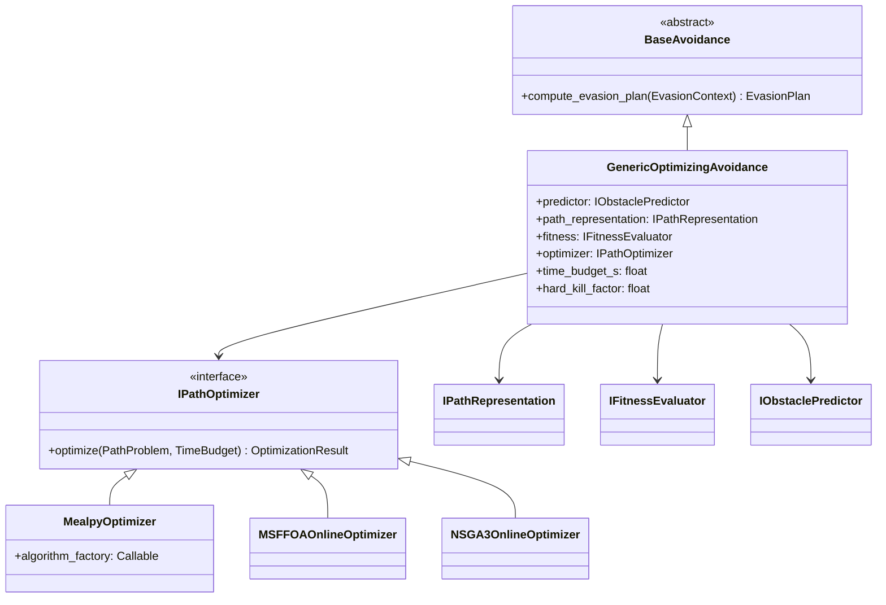

# src/algorithms/ — Algorytmy optymalizacji trajektorii roju dronów

Ten katalog zawiera implementacje zaawansowanych algorytmów ewolucyjnych i heurystycznych do **planowania trajektorii roju UAV**. Skupia się na optymalizacji wielokryterialnej (czas, energia, ryzyko kolizji) z modułem unikania przeszkód działającym **online** (w czasie lotu).

## 🏗️ Architektura i wzorce projektowe
```
src/algorithms/
├── abstraction/                # Strategie offline (planowanie globalne, Strategy Pattern)
├── avoidance/                  # Reaktywne unikanie kolizji (online, 1 s budżet decyzyjny)
└── SwarmFlightController.py    # Kontroler śledzący trajektorię + integrujący online avoidance
```

**Kluczowe cechy:**
- **Strategy Pattern** — algorytmy wymienialne przez konfigurację Hydra (`_target_` w yamlach)
- **Offline** (planowanie globalne) + **Online** (reaktywna korekta w czasie lotu)
- **Przeszkody**: cylindry (rzut 2D+Z), boxy (AABB)
- **Twardy budżet czasu**: każda decyzja online ≤ 1 s (cooperative `TimeBudget` + outer SIGALRM `hard_deadline` jako circuit breaker)

## 🎯 Strategie offline (`abstraction/trajectory/strategies/`)

Globalna optymalizacja trajektorii dla całego roju (zwykle pop_size~1000, 200 generacji):

| Strategia | Algorytm | Typ | Zastosowanie |
|-----------|----------|-----|--------------|
| `msffoa_strategy.py` | **MSFOA** | Wielo- (skalaryzacja SOO) | Multi-swarm dla 3D terenów (Shi et al. 2020) |
| `nsga3_swarm_strategy.py` | **NSGA-III** | Wieloobiektywowa | Pareto-optymalność roju (Deb & Jain 2014) |
| `ooa_strategy.py` | **OOA** | SOO (mealpy) | Osprey Optimization (Dehghani 2023) |
| `ssa_strategy.py` | **SSA** | SOO (mealpy) | Sparrow Search (Xue & Shen 2020) |
| `soo_adapter.py` | **Adapter** | Skalaryzacja MOO→SOO | Wspólny interfejs dla SSA/OOA/MSFOA |

**Wsparcie NSGA-III:** `nsga3_utils/` (core_math, decision_maker, swarm_evolution)

## 🛡️ Unikanie przeszkód online (`avoidance/`)

Architektura **Strategy + Composition** — `GenericOptimizingAvoidance` komponuje 4 wymienialne sub-strategie:

```
avoidance/
├── BaseAvoidance.py                    # Interfejs zewnętrzny (compute_evasion_plan)
├── GenericOptimizingAvoidance.py       # Komponuje 4 sub-strategie + zarządza budżetem czasu
├── interfaces.py                       # 4 ABC: IObstaclePredictor, IPathRepresentation,
│                                       #         IFitnessEvaluator, IPathOptimizer
├── budget.py                           # TimeBudget (cooperative) + hard_deadline (SIGALRM)
├── EvasionContextBuilder.py            # Preprocesor: rejoin point, search bbox, kierunki
│
├── predictors/
│   └── ConstantVelocityPredictor.py    # IObstaclePredictor: liniowa ekstrapolacja
├── path/
│   ├── _jit_kernels.py                 # Numba: DP, resample, fallback, tangent_leads, space_in_xy
│   └── BSplineYZGenes.py               # IPathRepresentation: geny (Δy,Δz) → BSpline (X liniowo)
├── fitness/
│   └── WeightedSumFitness.py           # IFitnessEvaluator: w_safety+w_energy+w_jerk+w_symmetry
├── optimizers/
│   ├── MealpyOptimizer.py              # IPathOptimizer: generyczny adapter mealpy (SSA/OOA)
│   ├── MSFFOAOnlineOptimizer.py        # IPathOptimizer: MSFOA paper Eq. 7-19 na YZ-genach
│   └── NSGA3OnlineOptimizer.py         # IPathOptimizer: pymoo NSGA-III multi-obj (4 cele)
└── ThreatAnalyzer/
    └── ThreatAnalyzer.py               # LiDAR hits → ThreatAlert + EvasionContext
```

## 🎯 Algorytmy avoidance dostępne w `configs/avoidance/`

| Yaml | Algorytm | Optimizer | Path repr | Fitness |
|------|----------|-----------|-----------|---------|
| `ssa.yaml` | **SSA** (Sparrow Search) | `MealpyOptimizer(OriginalSSA)` | `BSplineYZGenes` | `WeightedSumFitness` |
| `ooa.yaml` | **OOA** (Osprey) | `MealpyOptimizer(OriginalOOA)` | `BSplineYZGenes` | `WeightedSumFitness` |
| `msffoa.yaml` | **MSFOA** (Multi-swarm Fruit Fly) | `MSFFOAOnlineOptimizer` | `BSplineYZGenes` | `WeightedSumFitness` |
| `nsga-3.yaml` | **NSGA-III** (referencyjny) | `NSGA3OnlineOptimizer` | `BSplineYZGenes` | `WeightedSumFitness` (multi-obj) |
| `none.yaml` | brak unik | — | — | — |

**Działanie**: `SwarmFlightController` wykrywa zagrożenia przez LiDAR → buduje `EvasionContext` → `compute_evasion_plan` zwraca lokalny BSpline ucieczkowy + rejoin point → drone PID śledzi → po dotarciu do rejoin powrót do trajektorii bazowej.

## 🔄 Diagram Strategy Pattern (avoidance online)



## 🚀 Użycie

```bash

# Algorytm ewolucyjny (przykład: SSA)
python main.py environment=forest avoidance=ssa

# Porównanie 4 algorytmów online (każdy ma swój yaml):
python main.py environment=urban avoidance=ssa
python main.py environment=urban avoidance=ooa
python main.py environment=urban avoidance=msffoa
python main.py environment=urban avoidance=nsga-3
```

Wszystkie 4 ewolucyjne yamle dzielą tę samą strukturę (predictor + path_representation + fitness) — różnią się TYLKO sekcją `optimizer`. To zgodnie z założeniem Strategy Pattern z Fazy 2 architektury.

## 📚 Literatura

- **MSFOA**: Shi, Zhang & Xia (2020), "Multiple Swarm Fruit Fly Optimization Algorithm Based Path Planning Method for Multi-UAVs", Applied Sciences 10(8):2822.
- **NSGA-III**: Deb & Jain (2014), "An Evolutionary Many-Objective Optimization Algorithm Using Reference-Point-Based Nondominated Sorting Approach", IEEE T. Evol. Comp. 18(4).
- **OOA**: Dehghani & Trojovský (2023), "Osprey optimization algorithm", Frontiers in Mechanical Engineering.
- **SSA**: Xue & Shen (2020), "A novel swarm intelligence optimization approach: sparrow search algorithm", Systems Science & Control Engineering.
- **A* dla UAV 3D grid**: Hart, Nilsson & Raphael (1968) + Karaman & Frazzoli (2011) ekstensja kinodynamiczna.
- **Sticky-axis evasion**: Fiorini & Shiller (1998), "Motion Planning in Dynamic Environments Using Velocity Obstacles", IJRR 17(7).

## 🧪 Status rozwoju

✅ Strategie offline (NSGA-III/MSFOA/OOA/SSA) — gotowe  
✅ Online avoidance: A* (Faza 1) + 4 algorytmy ewolucyjne (Faza 2) — gotowe  
✅ Twardy budżet czasu (cooperative + SIGALRM circuit breaker) — gotowe  
✅ Mypy zielony dla `src/algorithms/avoidance/`  
⏳ Walidacja w środowisku z dynamicznymi przeszkodami — do końcowych eksperymentów

**Autor**: Edwin Harmata (praca magisterska — algorytmy inspirowane biologicznie dla roju dronów)

**Data**: Kwiecień 2026
