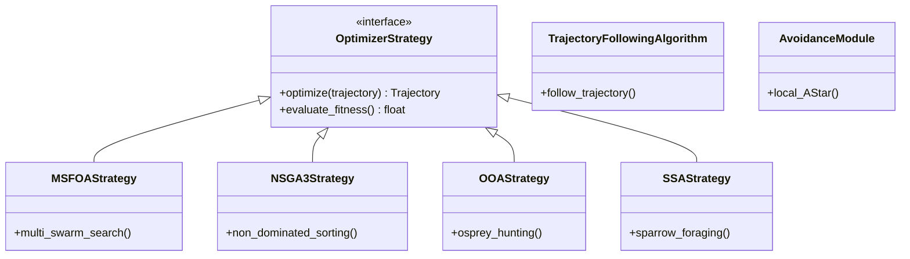

# src/algorithms/ — Algorytmy optymalizacji trajektorii roju dronów

Ten katalog zawiera implementacje zaawansowanych algorytmów ewolucyjnych i heurystycznych do **planowania trajektorii roju UAV**. Skupia się na optymalizacji wielokryterialnej (czas, energia, ryzyko kolizji) z modułem unikania przeszkód działającym **online** (w czasie lotu).

## 🏗️ Architektura i wzorce projektowe
```
src/algorithms/
├── abstraction/          # Abstrakcyjne strategie (Strategy Pattern)
├── avoidance/            # Reaktywne unikanie przeszkód (online)
├── BaseAlgorithm.py      # Przestarzałe (do usunięcia)
├── TrajectoryFollowingAlgorithm.py  # Śledzenie trajektorii
```

**Kluczowe cechy:**
- **Strategy Pattern** — algorytmy przełączane przez konfigurację **Hydra**
- **Offline** (planowanie) + **Online** (reakcja)
- **Przeszkody**: cylindry (rzut 2D+Z), boxy (AABB)
- **Funkcje celu** (`objective_constrains.py`):
  - Wielokryterialna ocena: **Długość**, **Ryzyko**, **Energia**
  - Segmentowa weryfikacja ciągłości ruchu
  - Ograniczenia geometryczne: **Uniformity**, **Smoothness**

## 🎯 Strategie optymalizacji (Strategy Pattern)

| Strategia | Algorytm | Typ | Zastosowanie |
|-----------|----------|-----|--------------|
| `msffoa_strategy.py` | **MSFOA** | Wieloobiektywowa | Multi-swarm dla 3D terenów |
| `nsga3_swarm_strategy.py` | **NSGA-III** | Wieloobiektywowa | Ewolucja roju |
| `ooa_strategy.py` | **OOA** | Jedno-/wielo- | Globalna optymalizacja |
| `ssa_strategy.py` | **SSA** | Jedno-/wielo- | Szybka konwergencja UAV |
| `soo_adapter.py` | **Adapter** | Jednocelowa | Adaptacja algorytmów SOO |

**Wsparcie NSGA-III:** `nsga3_utils/` (core_math, decision_maker, swarm_evolution)

## 🛡️️ Unikanie przeszkód (fazą online)
```
avoidance/
├── BaseAvoidance.py      # Interfejs
├── AStarAvoidance.py     # A* lokalne
└── AStar/
    └── UAV3DGridSearch.py  # 3D grid A*
```
**Działanie**: Reaktywne korygowanie trajektorii w locie.

## 📊 Model trajektorii
```
abstraction/trajectory/
├── metrics/              # Pusty (do metryk)
├── objective_constrains.py  # Funkcje celu
├── plan.txt              # Przykładowa trajektoria
└── strategies/           # Strategie (patrz wyżej)
```

## 🔄 Diagram Strategy Pattern



## 🚀 Użycie

```python
# Konfiguracja Hydra
hydra_config:
  algorithm: msffoa_strategy  # Przełączanie strategii
  objectives: [length, risk, energy]
  obstacles: [cylinder, box]

# Przykład
strategy = MSFOAStrategy()
trajectory = strategy.optimize(initial_points, obstacles)
```

## 📚 Literatura

- MSFOA: Multi-swarm Fruit Fly Optimization dla multi-UAV
- NSGA-III: Wieloobiektywowa optymalizacja
- OOA: Osprey Optimization Algorithm
- SSA/SPSA: Sparrow Search dla UAV

## 🧪 Status rozwoju

✅ Gotowe strategie ewolucyjne  
✅ Funkcje celu i ograniczenia  
✅ Online avoidance (A*)  
⚠️ `BaseAlgorithm.py` — do usunięcia  
⏳ `metrics/` — do implementacji  

**Autor**: Edwin Harmata (praca magisterska — algorytmy inspirowane biologicznie dla roju dronów)

**Data**: Kwiecień 2026