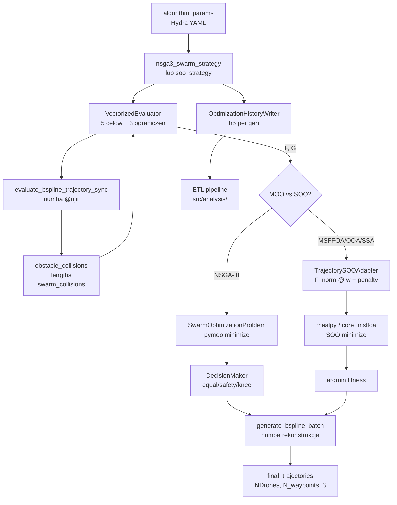

# Logika optymalizacji trajektorii roju UAV

Dokument opisuje formulacje problemu optymalizacyjnego, pipeline ewaluacji
i wspolne komponenty uzywane przez 4 strategie offline: **NSGA-III** (MOO)
oraz **MSFFOA**, **OOA**, **SSA** (SOO przez `TrajectorySOOAdapter`).

## Architektura

Centralnym elementem jest `VectorizedEvaluator` (`objective_constrains.py`),
ktory oblicza **5 celow** i **3 ograniczenia** wektorowo na calej populacji.
Ewaluator jest wspolny dla wszystkich 4 strategii — roznica polega na tym,
jak wynik (F, G) jest konsumowany:

- **NSGA-III** (`nsga3_swarm_strategy.py`): uzywa F i G bezposrednio
  przez `SwarmOptimizationProblem` (pymoo `Problem`). Selekcja przez
  niedominacje + kierunki referencyjne Das-Dennis.
- **MSFFOA / OOA / SSA**: uzywaja `TrajectorySOOAdapter` (`soo_adapter.py`),
  ktory normalizuje F przez F\_ref (Golden Rule #1), agreguje wazonym sumowaniem
  i dodaje weakest-link penalty z G (Golden Rule #2), zwracajac skalar fitness.

Ta architektura zapewnia **ceteris paribus** — identyczny evaluator,
identyczna inicjalizacja (`StraightLineNoiseSampling`), identyczna pula
obliczeniowa (`n_gen` generacji) — jedyna zmienna to mechanizm selekcji.

```
                    ┌─────────────────────┐
                    │ StraightLineNoise-  │
                    │ Sampling (shared)   │
                    │ rng=seeds.rng(...)  │
                    └────────┬────────────┘
                             │ populacja (Pop, N_var)
                 ┌───────────┴───────────┐
                 │                       │
          ┌──────▼───────┐      ┌────────▼──────────┐
          │ SwarmOptim.  │      │ TrajectorySOO-    │
          │ Problem      │      │ Adapter           │
          │ (pymoo)      │      │ F_norm @ w + pen  │
          └──────┬───────┘      └────────┬──────────┘
                 │                       │
          ┌──────▼───────────────────────▼──────┐
          │           VectorizedEvaluator        │
          │  5 celow (F) + 3 ograniczen (G)     │
          │  + numba B-spline collision check   │
          └─────────────────────────────────────┘
```

## Przestrzen decyzyjna

Zmienne decyzyjne to wspolrzedne (x, y, z) **wewnetrznych punktow kontrolnych**
B-spline per dron:

```
n_var = n_drones * n_inner_points * 3
```

Punkty startowe i docelowe sa **doklejane** w `_evaluate()` — nie sa
czescia genotypu. Pelny wielobok kontrolny:

```
control_polygon = [start_pos, inner_1..n, target_pos]
ksztalt: (PopSize, NDrones, n_inner + 2, 3)
```

### Granice zmiennych

| Os | Dolna granica | Gorna granica |
|:--|:--|:--|
| X, Y | `world_data.min_bounds - margin` | `world_data.max_bounds + margin` |
| Z | `max(ground + 0.5, min_endpoint_z - 0.2)` | `min(ceiling - 0.5, max_endpoint_z + 20.0)` |

Margines `margin = 10.0 m` pozwala punktom kontrolnym wychodzic poza srodowisko,
co jest konieczne dla wygenerowania krzywych omijajacych przeszkody przy krawedziach
mapy. Opcjonalne `min_altitude` / `max_altitude` nadpisuja domyslne Z.

## 5 celow (F-vector)

Reference: Deb, Pratap, Agarwal & Meyarivan (2002); Coello Coello (2007).

| Cel | Metoda | Definicja | Interpretacja |
|:--|:--|:--|:--|
| **f1** | `_f1_trajectory_cost` | `sum(lengths) + sum(\|cross(diff, v_norm)\|)` | Dlugosc trasy + odchylenie od prostej start-cel (shape penalty) |
| **f2** | `_f2_height_angle_cost` | `sum(\|z - h_pref\|) + sum(arctan(dz/dxy))` | Odchylenie od preferowanej wysokosci + kara za strome wznoszenie |
| **f3** | `_f3_threat_cost` | `sum(max(0, r_obs - dist_xy))` | Penetracja stref zagrozen (cylindrycznych/bounding-circle) |
| **f4** | `_f4_turn_cost` | `sum(arccos(u_i . u_{i+1})^2)` | Kara za ostre zakrety w plaszczyznie poziomej |
| **f5** | `_f5_coordination_cost` | `sum(a_ij * penalty * exp(safe - dist))` | Wykladnicza kara za zblizenie dronow ponizej `min_drone_distance` |

Wszystkie cele sa minimalizowane (lower = better).

### f1: Trajectory cost (length + shape)

Skladnik dlugosci (`f_length`) to suma dlugosci B-spline per dron,
liczona przez numba w `evaluate_bspline_trajectory_sync`. Skladnik shape
(`f_shape`) mierzy odleglosc punktow kontrolnych od prostej start-cel
(iloczyn wektorowy -> odleglosc punkt-prosta), co penalizuje trajektorie
"wezowate" nawet jesli maja porownywalna dlugosc.

### f2: Height + angle cost

Parametr `preferred_height` (domyslnie 15.0 m) definiuje preferowana
wysokosc lotu. `f_height` karze odchylenia od tej wysokosci. `f_angle`
karze strome segmenty (duzy kat nachylenia `arctan(dz/dxy)`), co
preferuje trajektorie o lagodnym profilu pionowym.

### f3: Threat cost

Liczy glebokosci penetracji stref przeszkod (soft penalty). Dla
`ObstacleShape.BOX` promien obliczany jest jako bounding circle:
`sqrt(half_lx^2 + half_wy^2) + safety_margin`. Rozni sie od twardego
ograniczenia G[0] — f3 jest celem do minimalizacji (trade-off z innymi
celami), G[0] jest ograniczeniem (musi byc <= 0 dla feasibility).

### f4: Turn cost

Kat miedzy kolejnymi wektorami kierunkowymi w plaszczyznie XY,
podniesiony do kwadratu. Kwadrat penalizuje duze zakrety superliniowo
wzgledem malych, promujac trajektorie o lagodnych lukach.

### f5: Coordination cost

Mechanizm wykładniczy: `penalty * exp(safe_dist - dist)`. Aktywna
macierz `a_ij` zeruje wplyw par dronow odleglych o wiecej niz
`min_drone_distance` (domyslnie 2.0 m). Macierz symetryczna z zerowa
przekatna. Cel penalizuje zarówno kolizje miedzy dronami jak i brak
separacji.

## 3 ograniczenia nierownosci (G-vector)

Konwencja pymoo: G <= 0 oznacza feasible. Ograniczenia sa twarde —
rozwiazanie naruszajace ktorekolwiek jest niefeasible.

| Ograniczenie | Definicja | Interpretacja |
|:--|:--|:--|
| **G[0]** | `sum(obs_collisions, axis=1)` | Twarda kolizja z przeszkodami (segment-level numba check) |
| **G[1]** | `swarm_collisions_hard - 0.01` | Twarda kolizja miedzy dronami (pary blizej niz `min_drone_dist`) |
| **G[2]** | `kinematic_penalty` = dist\_violations + accel\_violations | Naruszenie limitu dystansu miedzy wezlami + naruszenie limitu przyspieszenia |

### Kinematic penalty (G[2])

Dwa skladniki:
1. **Distance violations**: `max(0, ||diff1|| - max_node_distance)` per segment.
   `max_node_distance` jest **dynamiczny** — obliczany przez
   `calculate_dynamic_max_node_distance()` na podstawie najdluzszej
   trasy euklidesowej, liczby punktow posrednich i `k_factor` (domyslnie 2.0).
2. **Acceleration violations**: `max(0, ||diff2|| - max_accel_limit)` per drugie
   roznice. `max_accel_limit` z parametrow (domyslnie 5.0). Karze zbyt
   ostre zmiany kierunku w przestrzeni 3D.

## Ewaluacja B-spline (numba)

Pipeline ewaluacji zaimplementowany w `bspline_utils.py` uzywa
`@njit(cache=True)` dla wydajnosci:

```
evaluate_bspline_trajectory_sync(control_points, obstacles_xy,
                                  obstacle_radii, min_drone_dist)
-> (obstacle_collisions, lengths, swarm_collisions)
```

### Przebieg

1. **Clamping**: `clamp_control_points_batch` powtarza pierwszy i ostatni
   punkt kontrolny 3x (kubiczny B-spline stopnia 3 wymaga krotnosci k
   na koncach dla interpolacji przez P[0] i P[-1]).
2. **Adaptive sampling**: Liczba probek per segment skaluje sie z dlugoscia
   wieloboku kontrolnego (`max(30, ctrl_poly_len * 4)`).
3. **Per-sample**: Obliczanie bazy kubicznego B-spline (`bspline_basis_cubic`),
   akumulacja dlugosci, obstacle collision check (`point_to_segment_dist_sq`),
   inter-drone distance check.
4. **Wynik**: `obstacle_collisions (Pop, NDrones)`, `lengths (Pop, NDrones)`,
   `swarm_collisions (Pop,)`.

### Rekonstrukcja koncowa

`generate_bspline_batch(control_points, num_samples)` generuje gladkie
trajektorie z `num_samples` probkami. Uzywa tego samego klamrowania co
ewaluator — krzywa identyczna z ta oceniana w optymalizacji.

## TrajectorySOOAdapter

Most miedzy 5-obiektowym `VectorizedEvaluator` a skalarnym fitness
dla metaheurystyk SOO (MSFFOA, OOA, SSA).

### Pipeline

```
inner_waypoints (Pop, N_drones, N_inner, 3)
    -> doklejenie start/target -> trajectories (Pop, N_drones, N_inner+2, 3)
    -> VectorizedEvaluator.evaluate() -> F (Pop, 5), G (Pop, 3)
    -> Golden Rule #1: F_norm = F / F_ref
    -> fitness = F_norm @ weights
    -> Golden Rule #2: penalty = penalty_weight * max(max(0, G), axis=1)
    -> return fitness + penalty
```

### Golden Rule #1: Normalizacja celów

`F_ref` obliczane przez ewaluacje trajektorii liniowej (start -> cel)
na etapie inicjalizacji adaptera. Kazdy cel dzielony jest przez swoja
wartosc referencyjną, co sprowadza wszystkie cele do bezwymiarowej
skali ~1.0. Zapobiega to dominacji celow o wiekszej skali numerycznej
(np. dlugosc w metrach vs kat w radianach).

### Golden Rule #2: Weakest-link penalty

Zamiast sumowania naruszen ograniczen (ktore pozwalaloby jednej
katastrofalnej kolizji zostac rozcienconej przez czyste ograniczenia),
penalty jest definiowane przez **najgorsze** pojedyncze naruszenie:
`max(max(0, G), axis=1)`. Jedno krytyczne naruszenie automatycznie
dominuje fitness.

## StraightLineNoiseSampling

Wspolna strategia inicjalizacji dla wszystkich 4 strategii. Generuje
populacje poczatkowa przez interpolacje liniowa miedzy startem a celem
z dodanym szumem Gaussa.

### Szum anizotropowy

```
noise_scale[..., 0:2] *= noise_std_xy   (domyslnie 2.0 m)
noise_scale[..., 2]   *= noise_std_z    (domyslnie 0.3 m)
```

Mniejszy szum w Z zapobiega "rozsypaniu" populacji Z na caly zakres
w scenariuszach, gdzie roznica wysokosci start-cel jest rzedu
pojedynczych metrow (typowe w forest/urban). Szum izotropowy
powoduje klipowanie wiekszosc osobnikow do dolnego limitu Z.

### Determinizm

Parametr `rng: np.random.Generator | int | None` — `SeedRegistry`
wstrzykuje `seeds.rng("sampling")` dla reprodukowalnosci miedzy runami.

## Strategia NSGA-III

### Das-Dennis reference directions

Liczba partycji obliczana dynamicznie przez `calculate_n_partitions(pop_size, n_obj=5)`,
aby liczba punktow referencyjnych `H = C(n_obj + p - 1, p)` byla jak
najblizzsza `pop_size`. Dla 5 celow i pop\_size=100: p=3, H=35
(NSGA-III faktycznie uzywa |ref\_dirs| jako pop\_size).

Reference: Das & Dennis (1998) "Normal-boundary intersection: A new
method for generating the Pareto surface in nonlinear multicriteria
optimization problems", SIAM J. Optim. 8(3):631-657.

### Operatory ewolucyjne

| Operator | Implementacja | Parametry |
|:--|:--|:--|
| Krzyzowanie | `SBX` (Simulated Binary Crossover) | `eta_c` (domyslnie 15), `prob` (domyslnie 0.9) |
| Mutacja | `PM` (Polynomial Mutation) | `eta_m` (domyslnie 20), `prob` (domyslnie 0.1) |

Reference: Deb & Agrawal (1995); Deb & Goyal (1996).

### Terminacja

Stale `n_gen` generacji (domyslnie 100) — identyczne dla NSGA-III
i metaheurystyk SOO (`epoch` w mealpy). Wczesniejsze wersje uzywaly
`MultiConditionTermination` z przerywaniem po znalezieniu `min_ideal_solutions`
feasible rozw. — to powodowalo niesprawiedliwe porownanie (rozny budzet
obliczeniowy per algorytm) i bledy `res.X is None` w pymoo.

### Zapis historii (OptimizationHistoryWriter)

`_HistoryCallback` (pymoo `Callback`) zapisuje per generacja:
- `objectives_matrix`: F (Pop, 5)
- `decisions_matrix`: X (Pop, n\_var)
- `feasible_mask`: bool per osobnik
- `constraint_violation`: CV per osobnik
- `elapsed_s`: wallclock per gen
- `eval_count_cumulative`: NFE (`evaluator.individuals_evaluated`)

Format: HDF5 (`optimization_history.h5`). Konsumowany przez pipeline
ETL (`populate_moo_quality`, `populate_offline_objectives`).

### Wybor rozwiazania (Decision Making)

Po zakonczeniu optymalizacji, jedno rozwiazanie z frontu Pareto wybierane
jest przez strategie decyzyjna (`decision_maker.py`):

| Strategia | Klasa | Logika |
|:--|:--|:--|
| `equal` | `EqualWeightsDecision` | Min-Max normalizacja + minimalna srednia znormalizowanych celow |
| `safety` | `SafetyPriorityDecision` | Hierarchicznie: (1) odrzuc f3 > 0 (threat), (2) z pozostalych min f1 |
| `knee_point` | `KneePointDecision` | Min odleglosc do utopia point w znormalizowanej przestrzeni |

Wszystkie strategie wstepnie filtruja rozwiazania feasible
(`filter_feasible`: CV <= 1e-6). Jesli brak feasible — wybieraja
"najmniejsze zlo" ze wszystkich rozwiazan.

Reference: Deb & Gupta (2011) "Understanding knee points in bicriteria
problems and their implications as preferred solution principles".

## Fallback

Jesli optymalizacja nie zwroci rozwiazan (`res.X is None`):
- NSGA-III: generuje trajektorie liniowa start -> cel z dolnym
  ograniczeniem `min_safe_altitude`.
- SOO strategie: obsluga analogiczna w poszczegolnych `*_strategy.py`.

## NFE tracking

`VectorizedEvaluator` zlicza:
- `evaluation_number`: liczba wywolan `evaluate()` (calls)
- `individuals_evaluated`: sumaryczna liczba ewaluowanych osobnikow (NFE)

NFE jest standardowa miara budrzetu obliczeniowego w literaturze
meta-heurystyk (Hansen et al. 2009 BBOB) i jest porownywalna
cross-algorytm niezaleznie od rozmiaru populacji.

## Diagram integracji



## Kluczowe pliki

| Plik | Rola |
|:--|:--|
| `objective_constrains.py` | `VectorizedEvaluator` — 5 celow, 3 ograniczen |
| `strategies/nsga3_swarm_strategy.py` | `SwarmOptimizationProblem`, `_HistoryCallback`, `nsga3_swarm_strategy()` |
| `strategies/soo_adapter.py` | `TrajectorySOOAdapter` — most MOO->SOO |
| `strategies/shared/bspline_utils.py` | numba B-spline: ewaluacja, rekonstrukcja, kinematyka |
| `strategies/shared/StraightLineNoiseSampling.py` | Wspolna inicjalizacja populacji |
| `strategies/nsga3_utils/decision_maker.py` | MCDM: Equal, Safety, KneePoint |
| `strategies/msffoa_strategy.py` | Strategia MSFFOA (core\_msffoa + SOO adapter) |
| `strategies/ooa_strategy.py` | Strategia OOA (mealpy OriginalOOA + SOO adapter) |
| `strategies/ssa_strategy.py` | Strategia SSA (mealpy OriginalSSA + SOO adapter) |
| `strategies/timing_utils.py` | `TimingCollector` — pomiar czasu per etap |
