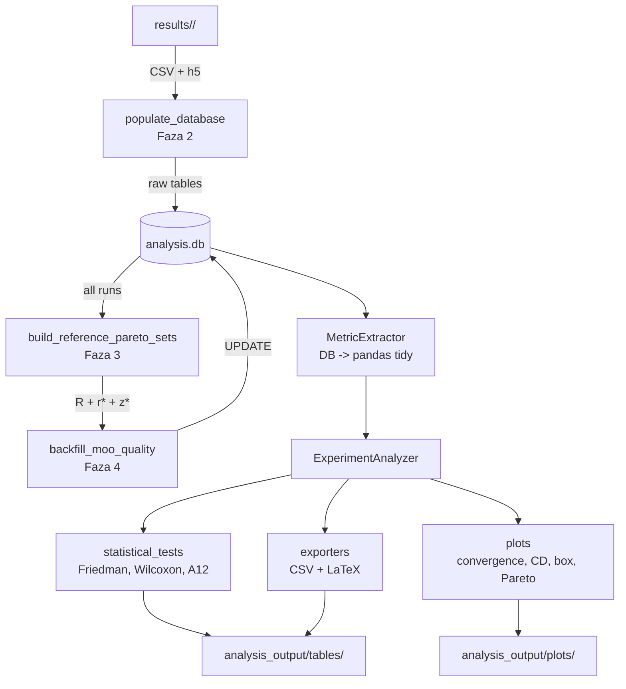

# src/analysis/ — Pipeline ETL i analiza porownawcza meta-heurystyk

Pipeline analizy eksperymentalnej dla porownania bio-inspirowanych algorytmow
planowania trajektorii roju UAV (MSFOA, OOA, SSA) z klasycznym NSGA-III.
Architektura dwufazowa: **ETL** (CSV/h5 -> SQLite) w `db/` i **analiza
statystyczna** (testy rankingowe, wskazniki MOO, wykresy) w `analyzer/`.

## Struktura

```
src/analysis/
├── ExperimentAggregator.py          # Orkestrator ETL (4-fazowy pipeline)
├── ETL_TABLES.md                    # Dokumentacja per-tabela (legacy)
├── analyzer/
│   ├── ExperimentAnalyzer.py        # Fasada analizy porownawczej
│   ├── metric_extractor.py          # DB -> pandas (tidy DataFrames)
│   ├── statistical_tests.py         # Friedman, Wilcoxon, A12, Bootstrap CI
│   ├── exporters/
│   │   ├── csv_exporter.py          # DataFrame -> CSV
│   │   └── latex_exporter.py        # DataFrame -> LaTeX tabularx
│   └── plots/
│       ├── _common.py               # Wspolne ustawienia matplotlib
│       ├── convergence_plots.py     # Krzywe zbieznosci per metryka
│       ├── box_plots.py             # Boxploty per (env, optimizer)
│       ├── cd_diagram.py            # Critical Difference diagram (Demsar 2006)
│       ├── pareto_plots.py          # Projekcje 2D frontu Pareto
│       ├── scatter_plots.py         # Scatter offline vs online
│       ├── ranking_plots.py         # Heatmapa rankingow
│       └── bar_plots.py             # Failure rate, success, collisions
└── db/
    ├── schema.sql                   # DDL: 17 tabel + 5 widokow + indeksy
    ├── initialize_database.py       # Tworzy analysis.db z schema.sql
    ├── populate_database.py         # Ladowanie CSV/h5 per-run (17 krokow)
    ├── populate_trajectory_metrics.py
    ├── populate_uav_metrics.py
    ├── populate_run_metrics.py
    ├── populate_iteration_metrics.py
    ├── populate_online_metrics.py
    ├── populate_online_safety_metrics.py  # Inter-UAV, energy, smoothness
    ├── populate_offline_objectives.py     # F-vector z h5 -> run_metrics
    ├── populate_moo_quality.py            # GD, IGD+, Spread, Spacing, R2, HV
    ├── build_reference_pareto.py          # Cross-run merged ND front + r*
    └── utils.py                           # Parsowanie nazw katalogow, konwersje
```

## Pipeline ETL — ExperimentAggregator

Czterofazowy pipeline z **krytyczna kolejnoscia** operacji. Fazy 3-4 wymagaja
kompletnosci fazy 2 (wszystkie runy w DB), poniewaz budowa reference Pareto
set wymaga polaczenia frontow ze **wszystkich** runow per (environment, n\_obj).

```
Faza 1: initialize_database(experiment_dir)
    └── Tworzy analysis.db z schema.sql (DDL idempotentne: CREATE IF NOT EXISTS)

Faza 2: populate_database(experiment_dir)
    └── Per-run: CSV/h5 -> tabele surowe + MOO quality bez referencji
        (spread, spacing, R2 — nie wymagaja reference set R)

Faza 3: build_reference_pareto_sets(conn, experiment_dir)
    └── Merged non-dominated front z last-gen feasible rozw. ze wszystkich
        runow per (env, n_obj). Wpisuje R do `reference_pareto_sets`
        i r* do `reference_points`.

Faza 4: backfill_moo_quality_with_reference(conn, refs)
    └── Re-liczy GD/IGD+/HV per generacja per run z R jako celem.
        UPDATE'uje `optimization_generation_stats`, `iteration_metrics`,
        `run_metrics`, `offline_objectives`.
```

Reference: Riquelme, Lucken & Baran (2015) "Performance metrics in
multi-objective optimization", CLEI Electronic Journal 18(1).

### Sekwencja per-run (Faza 2)

Kazdy run ladowany jest atomicznie z `try/except` — blad pojedynczego
runu nie blokuje calej agregacji. Status (`aggregation_status`) zapisywany
w tabeli `runs` umozliwia identyfikacje i ponowne uruchomienie
nieudanych runow.

```
 1. _register_run_files         — rejestr plikow zrodlowych (run_files)
 2. _load_optimization_timings  — czasy etapow optymalizacji (CSV)
 3. _load_collisions            — zdarzenia kolizji (CSV)
 4. _load_evasion_events        — zdarzenia unikowe (CSV)
 5. _load_world_boundaries      — granice swiata 3D (CSV)
 6. _load_generated_obstacles   — przeszkody statyczne (CSV)
 7. _load_counted_trajectories  — waypoints offline (CSV)
 8. _load_trajectories          — probki trajektorii rzeczywistej (CSV)
 9. _load_optimization_history  — historia ewolucji z h5 (feasibility,
                                  diversity, non-dominated sorting, HV)
10. populate_online_metrics     — online_optimization_tasks +
                                  online_convergence_traces (CSV)
11. populate_moo_quality        — spread, spacing, R2 per generacja
                                  (bez R — GD/IGD+/HV odroczone do Fazy 4)
12. populate_trajectory_metrics — dlugosci i wysokosci per UAV
13. populate_iteration_metrics  — pivotowanie optimization_generation_stats
                                  do formatu (run_id, iteration, col1..colN)
14. populate_uav_metrics        — agregaty kolizji/unikow per dron
15. populate_online_safety_metrics — inter-UAV distance, energy, smoothness
16. populate_run_metrics        — koncowy agregat per-run (32 kolumny)
17. populate_offline_objectives — F-vector z h5 -> UPDATE run_metrics
```

Kluczowa zaleznosc: `populate_run_metrics` (krok 16) agreguje dane
z krokow 12-15, wiec musi byc wywolany **po** nich. `populate_offline_objectives`
(krok 17) wykonuje `UPDATE` na istniejacym wierszu `run_metrics`.

## Schemat bazy danych

SQLite z `PRAGMA foreign_keys = ON`. 17 tabel, 5 widokow, indeksy OLAP.

### Tabele kluczowe

| Tabela | Klucz glowny | Opis |
|--------|-------------|------|
| `runs` | `run_id` | Metadane runu: optimizer, avoidance, environment, seed, status agregacji |
| `run_metrics` | `run_id` | Koncowy agregat per-run: 32 kolumny (offline F-vector, MOO quality, online safety) |
| `iteration_metrics` | `(run_id, iteration)` | Seria czasowa per generacja: zbieznosc, feasibility, MOO indicators |
| `uav_metrics` | `(run_id, uav_id)` | Per-UAV: path length, collisions, evasions |
| `uav_online_metrics` | `(run_id, uav_id)` | Per-UAV online: inter-UAV distance, energy, smoothness |
| `optimization_generation_stats` | `(run_id, gen, source, metric)` | Surowe metryki per generacja (EAV format) |
| `evasion_events` | `(run_id, event_index)` | Per-zdarzenie unikowe: TTC, dist\_to\_threat, preferred\_axis, wallclock |
| `online_optimization_tasks` | `(run_id, drone_id, trigger_time)` | Pojedyncze wywolanie optymalizatora online |
| `online_convergence_traces` | `(run_id, drone_id, trigger_time, gen)` | Sledzenie zbieznosci optymalizatora online |
| `reference_pareto_sets` | `(env, n_obj, point_idx, obj_j)` | Merged ND front cross-run (reference set R) |
| `reference_points` | `(env, n_obj, obj_j)` | Reference point r\* + ideal z\* per (env, n\_obj) |

### Widoki analityczne

| Widok | Zastosowanie |
|-------|-------------|
| `vw_run_summary` | runs LEFT JOIN run\_metrics — pelny obraz per run |
| `vw_seed_summary` | Agregacja per (env, optimizer, avoidance, seed) |
| `vw_global_summary` | Agregacja per (env, optimizer, avoidance) |
| `vw_run_online_summary` | Per-run performance online avoidance (wallclock, budget violations, rejoin quality) |
| `vw_algo_cross_sim_comparison` | Cross-simulation por. algorytmow online (SWaP, rejoin success rate, safety) |

### 5-obiektowy F-vector

Aktualny `VectorizedEvaluator` produkuje 5-obiektowy wektor celu:

| Indeks | Kolumna `run_metrics` | Opis |
|--------|----------------------|------|
| F[0] | `final_objective_f1_trajectory` | Trajectory cost (length + shape) |
| F[1] | `final_objective_f2_height_angle` | Height + angle cost |
| F[2] | `total_threat_cost` | Threat proximity cost |
| F[3] | `total_turn_penalty` | Turn penalty |
| F[4] | `total_coordination_cost` | Coordination cost |

`populate_offline_objectives` wyciaga best feasible solution (argmin po f1)
z last-gen `objectives_matrix` w h5 i mapuje F-vector na kolumny `run_metrics`.
Feasibility ustalana z `feasible_mask` lub `constraint_violation` w h5.
Dodatkowo wczytuje `objective_weights` z per-run `.hydra/config.yaml` i
zapisuje do `final_objective_weights_json` (NSGA-III: canonical fallback
`[0.05, 0.5, 0.8, 1.0, 0.25]`).

### `final_objective` — weighted normalized sum (2026-05-13)

Skalarny agregat F-vectora best-feasible solution, comparable cross-algorithm:

```
final_objective = Σ_{i=1..5} w_i · F_best[i] / F_ref_env[i]
```

gdzie:
- `w_i`: wagi z `final_objective_weights_json` (per-run hydra config dla
  SOO; canonical `[0.05, 0.5, 0.8, 1.0, 0.25]` dla NSGA-III).
- `F_ref_env[i]`: per-environment median F_best[i] across all algos/seeds,
  zapisana w `offline_objective_normalization`.

Liczone w post-pass `populate_final_objective_aggregated` (RAZ po pełnym
przejściu wszystkich runów przez `populate_offline_objectives` — wymaga
populacji do wyliczenia median).

**Trade-off F_ref median vs straight-line:** Faithful F_ref z trajektorii
prostej (`soo_adapter._compute_reference_scales`) wymagałby rekonstrukcji
`VectorizedEvaluator` w ETL. Median jako proxy preserves rankings
within-env-seed (wszystkie algorytmy w jednym bloku dzielone przez
tę samą stałą) → Friedman/Nemenyi p-values są niezmiennicze.

Reference: Hwang & Yoon (1981) Multiple Attribute Decision Making §4.2.

## Wskazniki jakosci MOO

Wskazniki liczone per generacja w `populate_moo_quality`, zapisywane do
`optimization_generation_stats` (EAV), pivotowane do `iteration_metrics`
przez `populate_iteration_metrics`. Ostatnia generacja kopiowana do
`run_metrics` jako `*_final` kolumny.

### Wskazniki niezalezne od reference set (Faza 2)

| Wskaznik | Definicja | Lower=better | Reference |
|----------|-----------|:---:|-----------|
| **Spread** Delta | `(d_f + d_l + Sum\|d_i - d_mean\|) / (d_f + d_l + (N-1)d_mean)` | tak | Deb, Pratap, Agarwal & Meyarivan (2002) eq. 15 |
| **Spacing** S | `sqrt(1/(N-1) Sum(d_i - d_mean)^2)`, `d_i = min_j L1(f_i, f_j)` | tak | Schott (1995) |
| **R2** | `(1/\|W\|) Sum_w min_a max_j w_j \|a_j - z*_j\|` | tak | Hansen & Jaszkiewicz (1998) |

Spread mierzy rownomiernosc rozkladu rozwiazan na froncie (Delta=0 idealnie
rownomierne). Spacing mierzy konsystencje odleglosci miedzy sasiadami (S=0
idealnie rownomierne). R2 uzywa wektorow wag z simpleksu Das-Dennis
(`n_partitions=8`) i jest odporny na monotoniczne transformacje przestrzeni
celow.

### Wskazniki wymagajace reference set R (Faza 4 — backfill)

| Wskaznik | Definicja | Lower=better | Reference |
|----------|-----------|:---:|-----------|
| **GD** | `(1/\|A\|) (Sum min_r L2(a, r)^p)^(1/p)`, p=2 | tak | Van Veldhuizen (1999) |
| **IGD+** | `mean_r min_f d+(r,f)`, `d+(r,f) = sqrt(Sum max(0, f_j - r_j)^2)` | tak | Ishibuchi, Masuda, Tanigaki & Nojima (2015) |
| **HV** | Objetosc obj-space zdominowana przez F, ograniczona r\* | **nie** (higher=better) | Zitzler & Thiele (1998) |
| **HV\_norm** | `HV / Pi(r* - z*)` — ∈ [0,1] | **nie** | Riquelme et al. (2015) Sec. 3.6 |

IGD+ jest wariantem Pareto-compliant IGD: kara `d+` asymetrycznie penalizuje
tylko komponenty gorsze niz reference (`max(0, f_j - r_j)`), co sprawia ze
wskaznik jest zgodny z relacja dominacji (Ishibuchi et al. 2015 Theorem 1).

## Budowa reference Pareto set (Faza 3)

W absencji analitycznie znanego "true Pareto front" (dostepnego jedynie
w syntetycznych benchmarkach ZDT/DTLZ) standard literaturowy dla problemow
real-world to **merged non-dominated front** zbudowany z feasible-ND rozw.
ostatniej generacji ze wszystkich runow per (environment, n\_obj).
Zastosowana procedura:

1. Dla kazdego runu: wyciagnij feasible front z last-gen `objectives_matrix`
   (h5), ustal feasibility z `feasible_mask` / `constraint_violation`.
2. Polacz (vstack) fronty ze wszystkich runow per (env, n\_obj).
3. Wykonaj non-dominated sorting na polaczonym zbiorze (pymoo
   `NonDominatedSorting`, Cython; fallback O(N^2) numpy).
4. Wynik = reference set R, zapisany do `reference_pareto_sets`.

Reference: Riquelme et al. (2015) Sec. 4; Ishibuchi et al. (2018).

### Reference point r\*

Obliczany jako:

```
r* = nadir + eps * range
```

gdzie `nadir = max(R, axis=0)`, `ideal = min(R, axis=0)`,
`range = nadir - ideal`, `eps = 0.1` (srodek zalecanego pasma [0.05, 0.2]).
Degenerate case (single-point R, range=0): fallback `range = max(|nadir|, 1.0)`.

Warunek konieczny dla HV > 0: `r* > f` komponentowo dla kazdego feasible f
na froncie. Margines eps=0.1 gwarantuje ten warunek przy zachowaniu sensownej
skali HV.

Reference: Ishibuchi, Imada, Setoguchi & Nojima (2018) "How to Specify a
Reference Point in Hypervolume Calculation for Fair Performance Comparison",
Evolutionary Computation 26(3):411-440, Eq. 4.

### Normalizacja HV

`hypervolume_normalized = HV / Pi(r* - z*)` gdzie `z* = ideal = min(R, axis=0)`.
Normalizacja mapuje HV do [0, 1] niezaleznie od skali przestrzeni celow,
co umozliwia porownanie cross-env (forest vs urban vs empty moga miec
diametralnie rozne zakresy wartosci celow). Capped at 1.0 — numeryczny drift
z sub-samplingu moze dac HV > denom o ~eps.

Reference: Riquelme et al. (2015) Sec. 3.6.

### Sub-sampling frontu dla HV w 5D+

Implementacja HV w pymoo (`HV`, algorytm WFG) jest pure-Python z
zlozonoscia O(M * N^(M-1)). W 5D:
- N=200: ~30s/call
- N=500: ~17h/call

Stala `HV_FRONT_SUBSAMPLE_THRESHOLD = 200` ogranicza rozmiar frontu
przed obliczeniem HV. Strategia sub-samplingu:
- Zachowaj M ekstremow (min per os — kotwice bounding box HV)
- Deterministyczny stride po sortowaniu wg f0 na pozostalych

Uniform sub-sampling z |S| punktow daje unbiased estymator HV
z bledem ~O(1/sqrt(|S|)).

Reference: Bringmann & Friedrich (2010); Ishibuchi et al. (2018) Sec. V.

## Metryki online safety

Trzy grupy metryk liczone post-hoc z `trajectory_samples` przez
`populate_online_safety_metrics`, zapisywane per UAV do `uav_online_metrics`,
agregowane do `run_metrics` przez `populate_run_metrics`.

### 1. Inter-UAV Collision Avoidance

Per time-step i UAV: `min_j ||p_i(t) - p_j(t)||` (odleglosc do najblizszego
sasiada). Agregacja: `min` i `mean` po t. `violation_count` = liczba time-stepow
gdzie minimalna odleglosc < `safety_threshold_m`.

Prog bezpieczenstwa: `DEFAULT_INTER_UAV_SAFETY_THRESHOLD_M = 4.0 m`
(= 2 x collision\_radius, gdzie collision\_radius = 2.0 m dla CF2X).

### 2. Energy Efficiency Proxy

```
energy_indicator = (integral ||v||^2 dt) / total_path_length_3d
```

F\_drag proporcjonalna v^2, wiec `integral v^2 dt` jest proxy total drag work.
Normalizacja przez path length zapewnia porownywalnosc trajektorii o roznej
dlugosci. Nizsze = wydajniejsze.

Reference: McAllister et al. (2017) "Quantifying energy efficiency of
multirotor UAV trajectories."

### 3. Trajectory Smoothness

```
smoothness_indicator = (integral ||a||^2 dt) / duration_s
```

Przyspieszenie liczone z roznicowania predkosci po probkach. Odpowiada
minimum-acceleration cost z literatury optymalizacji trajektorii.
Nizsze = gladsza trasa.

Reference: Hauser & Hubicki (2007).

## Framework testow statystycznych

Implementacja w `statistical_tests.py` zgodna z metodologia
`reports/statistical_tests_methodology.md` — trzy testy dobrane tak, aby
kazdy odpowiadal na odrebne pytanie naukowe bez nakladania sie funkcji.
Odrzucone metody (Wilcoxon+Holm, Bootstrap CI, Cochran's Q, McNemar+RD/OR,
ANOVA, Bonferroni) — pelne uzasadnienia w metodologii §5.

### Friedman + Nemenyi (metryki ciagle)

Test Friedmana z post-hoc Nemenyi. Critical difference (CD):

```
CD = q_alpha * sqrt(k(k+1) / (6N))
```

gdzie k = liczba algorytmow, N = liczba datasetow (env x seed),
q\_alpha z tabeli Nemenyi (Demsar 2006, Table 5b; k=2..10, alpha=0.05).

Wizualizacja: CD diagram (plik `cd_diagram.py`) — standardowy format
z prac porownawczych meta-heurystyk.

Reference: Demsar (2006) "Statistical Comparisons of Classifiers over
Multiple Data Sets", JMLR 7:1-30, eq. 13.

### Vargha-Delaney A12 (effect size, metryki ciagle)

Non-parametric effect size:

```
A12 = P(X < Y) + 0.5 * P(X = Y)
```

Interpretacja (lower-is-better): A12 > 0.5 oznacza ze algorytm A jest
lepszy od B. Magnitude per Vargha & Delaney (2000):

| |A12 - 0.5| | Magnitude |
|-------------|-----------|
| < 0.06 | negligible |
| 0.06 - 0.14 | small |
| 0.14 - 0.21 | medium |
| >= 0.21 | large |

Reference: Arcuri & Briand (2014) "A Hitchhiker's guide to statistical tests
for assessing randomized algorithms in software engineering", STVR 24(3).

### Wilson 95% CI (proporcje, failure rate)

95% przedzial ufnosci Wilsona dla proporcji binomialnej. Stosowany zamiast
Wald CI (ktory bywa ujemny / > 1 i ma katastrofalne pokrycie dla p̂
blisko 0 lub 1 — typowe w safety-critical).

```
CI = (1 / (1 + z²/N)) · [p̂ + z²/(2N) ± z · sqrt(p̂(1-p̂)/N + z²/(4N²))]
```

Brak nakladania sie przedzialow Wilsona dla dwoch algorytmow ⇒ roznica
proporcji istotna na poziomie α ≈ 0.05 (Cumming 2014 "ocular significance
test").

Reference: Wilson (1927) "Probable inference, the law of succession, and
statistical inference", JASA 22(158):209–212; Newcombe (1998) "Two-sided
confidence intervals for the single proportion", Stat. Med. 17(8):857–872.

### Summary stats (mediana + IQR)

`summary_stats()` generuje tabele: n, mean, std, min, max, median, q25, q75
per group. Para `(mediana, [Q1, Q3])` jest standardowa forma raportowania
rozkladow w literaturze metaheurystyk (Bartz-Beielstein i in. 2020 §4.2) —
IQR obejmuje 50% obserwacji i jest odporny na ogony niegausowskie. Flaga
`low_power_warning` zaznacza grupy z N < 6 (Friedman traci moc dla
asymptotycznego rozkladu χ² przy malym N).

## Deduplication offline vs online

Metryki **offline** (HV, IGD+, GD, spread, spacing, R2, convergence\_speed,
auc\_best\_so\_far, final\_objective, front\_size\_last\_gen) zaleza wylacznie
od (optimizer, environment, seed). W pelnym design eksperymentu kazdy
(opt, env, seed) jest testowany z 4 roznymi algorytmami avoidance, co
daje 4 **identyczne** kopie kazdej offline metryki per (opt, env, seed).

`_dedup_offline(df_run)` wykonuje `drop_duplicates(subset=["environment",
"optimizer", "seed"])` **przed** testami statystycznymi, eliminujac
pseudo-replikacje. Bez deduplikacji Wilcoxon/Friedman traktowalyby
4 identyczne wartosci jako niezalezne obserwacje, falszywie zawyzone N
prowadziloby do false-positive risk.

Metryki **online** (collision\_count, evasion\_event\_count, inter-UAV
distance, energy, smoothness) zaleza od (optimizer, environment, seed,
**avoidance**) — `avoidance` jest uprawnionym czynnikiem, wiec pelny
product stanowi prawdziwy dataset.

Reference: Demsar (2006) Sec. 3.1 — testy zakladaja niezalezne datasets.

## Analiza failure rate

Binarne flagi `is_offline_failure` i `is_online_failure` per run,
obliczane w `_compute_failure_flag()`:

| Flaga | Warunek | Interpretacja |
|-------|---------|---------------|
| **Offline failure** | `front_size_last_gen ∈ {NULL, 0}` OR `hypervolume ∈ {NULL, 0}` | Algorytm nie znalazl feasible ND rozw. pokrywajacych r\* (degenerate front) |
| **Online failure** | `collision_count > 0` | System avoidance nie zapobiegl kolizji |

Split na dwa niezalezne failure modes: offline failure to problem fazy
optymalizacji (algorytm nie zbiega), online failure to problem fazy avoidance
(reactive system nie unika przeszkod). Laczenie obu obscure'owaloby root cause.

Failure rate stanowi odporny proxy tail-risk algorytmu, uzupelniajacy
mean/median (ktore maskuja katastrofalne runy).

Reference: Liefooghe & Verel (2014).

## ExperimentAnalyzer — output

`ExperimentAnalyzer.analyze(experiment_dir)` generuje pelny raport
porownawczy w `<experiment_dir>/analysis_output/`.

### Metryki

| Zbior | Metryki | Block cols (datasets) |
|-------|---------|----------------------|
| **OFFLINE** (11) | hypervolume, hypervolume\_normalized, igd\_plus, gd\_final, spread\_final, spacing\_final, r2\_final, convergence\_speed\_gen, auc\_best\_so\_far, final\_objective, front\_size\_last\_gen | (environment, seed) |
| **ONLINE** (7) | collision\_count, evasion\_event\_count, min/mean\_inter\_uav\_distance\_m, total\_inter\_uav\_safety\_violations, mean\_energy\_indicator, mean\_smoothness\_indicator | (environment, seed, avoidance) |
| **ITER** (10) | hypervolume, hypervolume\_normalized, best\_so\_far, feasible\_ratio, front\_size, igd\_plus, gd, spread, spacing, r2\_indicator | — (per generacja) |

### Tabele (`analysis_output/tables/`)

Per metryka generowane sa:

| Plik | Zawartosc |
|------|----------|
| `summary_{metric}.csv/.tex` | n, mean, std, min, max, median, q25, q75, low\_power\_warning |
| `{env}_friedman_{metric}.csv` | Per-env: avg\_rank, statistic, p-value, CD\_nemenyi, n\_datasets |
| `{env}_a12_{metric}.csv` | Per-env, pary: A12 value, magnitude (negligible/small/medium/large) |
| `failure_rate_offline.csv/.tex` | Per (env, opt): n\_runs, n\_failures, failure\_rate, wilson\_ci95\_low/high |
| `failure_rate_online.csv/.tex` | j.w. dla evasion\_phase\_collisions > 0 |
| `failure_rate_hv_degenerate.csv/.tex` | j.w. dla HV=0 OR pusty front (diagnostyka NSGA-III) |
| `online_summary.csv` | Per-run online avoidance z vw\_run\_online\_summary |

### Wykresy (`analysis_output/plots/`)

| Podkatalog | Zawartosc |
|-----------|----------|
| `convergence/` | Krzywe zbieznosci per metryka iteracyjna (mean +/- CI per optimizer) |
| `boxplots/` | Boxploty offline (deduplicated) i online per (env, optimizer) |
| `cd_diagrams/` | Critical Difference diagram per offline metryka (Demsar 2006) |
| `rankings/` | Heatmapa rankingow per metryka |
| `pareto/` | Projekcje 2D frontow Pareto last-gen (per run, colored by optimizer) |
| `scatter/` | Scatter offline vs online (korelacja miedzy fazami) |
| `bar/` | Bar plots: success rate, collision count, failure rate (offline/online) |

## MetricExtractor

Klasa w `metric_extractor.py` transformuje dane z `analysis.db` do
pandas DataFrames w formacie tidy (Wickham 2014 "Tidy Data"):
kazdy wiersz = jedna obserwacja indeksowana (optimizer, environment, seed).

| Metoda | Zwraca | Zastosowanie |
|--------|--------|-------------|
| `run_summary()` | Per-run: offline + online aggregates | Summary tables, box plots, tests stat. |
| `iteration_history(metrics)` | Per-(run, iteration) time series | Convergence plots |
| `online_summary()` | Per-run online z `vw_run_online_summary` | Online performance analysis |
| `pareto_front_last_gen()` | Long-form last-gen feasible ND front | Pareto projection plots |

## Kluczowe decyzje architektoniczne

### SQLite jako backend analityczny

Wybor SQLite (zamiast np. PostgreSQL czy DataFrame-only) podyktowany:
- **Portabilnosc**: single-file `analysis.db` latwiejszy do udostepniania
  miedzy maszynami niz hierarchia CSV/h5.
- **Idempotentnosc**: `INSERT OR REPLACE` / `ON CONFLICT DO UPDATE` pozwalaja
  na bezpieczne re-runowanie ETL bez recznego kasowania.
- **SQL views**: aggregacje cross-run dostepne bez kodowania w Pythonie.
- **Foreign keys**: `PRAGMA foreign_keys = ON` + `ON DELETE CASCADE` zapewnia
  integralnosc referencjna i atomowe kasowanie runow.

### Dwuprzebiegowy backfill (Fazy 2 + 4)

GD, IGD+, HV wymagaja reference set R, ktory moze byc zbudowany dopiero
po zaladowaniu **wszystkich** runow. Stad:
- Faza 2: liczy spread/spacing/R2 (niezalezne od R)
- Faza 4: doladowuje GD/IGD+/HV z R, pomijajac redundantne przeliczenie
  spread/spacing/R2 (`compute_baseline_metrics=False` — ~70% oszczednosci)

### try/except per-run resilience

Pojedynczy blad ladowania (np. uszkodzony CSV, brakujace h5) nie blokuje
calej agregacji. `aggregation_status` w tabeli `runs` przechowuje stan:
`discovered -> aggregated | failed`. Pole `aggregation_error` zawiera
skrocony traceback (max 1 KB) dla diagnostyki.

### EAV format w `optimization_generation_stats`

Entity-Attribute-Value (run\_id, generation, source\_name, metric\_name,
metric\_value) zamiast szerokich kolumn: pozwala dodawac nowe metryki
(np. nowy wskaznik MOO) bez migracji schemy. `populate_iteration_metrics`
pivotuje EAV do formatu (run\_id, iteration, col1..colN) dla wygody
analiz.

### Idempotentnosc populatorow

Wszystkie populatory uzywaja `INSERT OR REPLACE` lub `DELETE WHERE run_id
= ? + INSERT`, co umozliwia bezpieczne re-runowanie ETL po poprawkach
kodu obliczen bez recznego kasowania bazy.

## Diagram integracji



## Uzycie

```bash
# 1. Agregacja ETL (tworzy analysis.db)
python -c "
from src.analysis.ExperimentAggregator import ExperimentAggregator
ExperimentAggregator().aggregate('./results/experiment_2026-05-06/')
"

# 2. Analiza porownawcza (generuje tables/ + plots/)
python -c "
from src.analysis.analyzer.ExperimentAnalyzer import ExperimentAnalyzer
ExperimentAnalyzer().analyze('./results/experiment_2026-05-06/')
"
```
