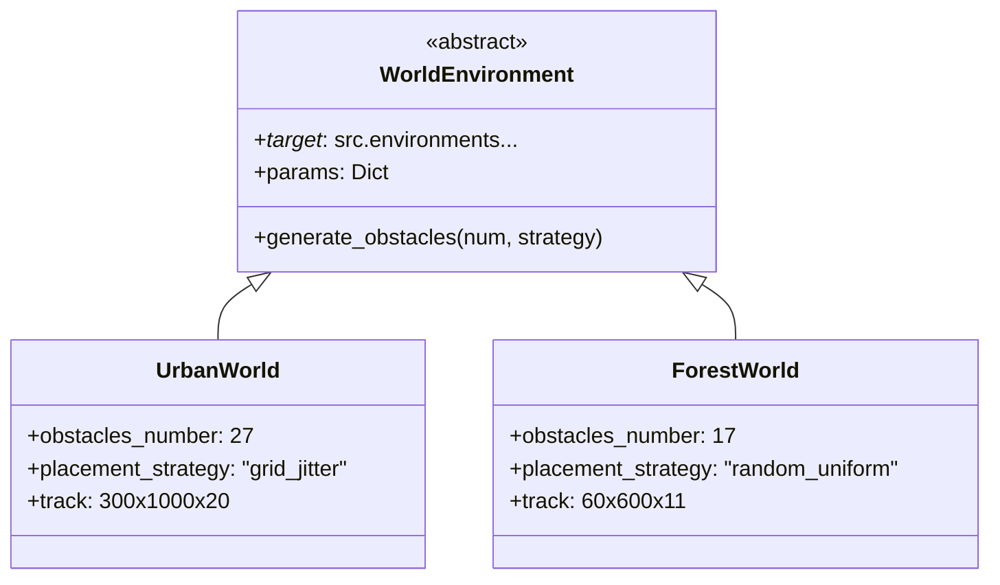

# src/environments/ — Środowiska symulacji roju dronów

Katalog definiuje **środowiska 3D** dla symulacji planowania trajektorii UAV. Każde środowisko zawiera przeszkody statyczne/dinamiczne, granice świata oraz generatory terenów. Zarówno przeszkody, jak i wymiary świata oraz strategie rozmieszczania przeszkód są dynamicznie konfigurowane.

## 🏗️ Struktura

```
src/environments/
├── abstraction/                # Generatory przeszkód i granic świata
├── obstacles/ObstacleShape.py  # Enum z typami przeszkód (BOX, CYLINDER)
├── EmptyWorld.py               # Puste środowisko (płaszczyzna)
├── ForestWorld.py              # Las (przeszkody cylindryczne)
├── SwarmBaseWorld.py           # Klasa bazowa do tworzenia świata
└── UrbanWorld.py               # Miasto (przeszkody w formie graniastosłupów)
```

## 🛠️ Abstrakcja generowania

```
abstraction/
├── generate_obstacles.py           # Generowanie przeszkód zgodnie z określoną strategią losowości 
├── generate_world_boundaries.py    # Granice świata (przestrzeń 3D)
```

**Funkcjonalności:**
- **Parametryzowane generowanie**: typy przeszkód, rozmiary, strategia umiszczania
- **Skalowalność**: różne rozmiary świata (np. 100x100x50m), ilość przeszkód
- **Seed reproducibility** dla eksperymentów

**Strategie rozmieszczenia** (z `safe_radius`):
- `strategy_random_uniform` — losowe, bez kolizji ze start/end
- `strategy_grid_jitter` — siatka + jitter (odchylenia)

## 🧱 Modele przeszkód

```
obstacles/
└── ObstacleShape.py    # Bazowe klasy 3D
```

**Typy przeszkód** (zgodne z `algorithms/objective_constrains.py`):
- **CYLINDER**: rzut 2D + wysokość Z (drzewa, słupy)
- **BOX**: AABB (bounding box) — budynki


**Metody**: `intersects(segment)`, `distance_to_point()`.

## 🌍 Implementacje środowisk (konfiguracja Hydra)

| Środowisko | Typ przeszkód | Liczba | Wymiary tunelu | Start/End | Zastosowanie |
|------------|---------------|--------|----------------|-----------|--------------|
| **UrbanWorld** | `BOX` | **27** | 300×1000×20m | [145-165, 5→995, 5m] | Miasto, grid_jitter |
| **ForestWorld** | `CYLINDER` | **17** | 60×600×11m | [20-40, 5→595, 1.5→2.5m] | Las, random_uniform |
| **EmptyWorld** | Brak | 0 | Konfigurowalne | Dowolne | Benchmarki |
| **SwarmBaseWorld** | Mieszane | Parametr | Parametr | Parametr | Rój 5+ UAV |

**Wspólne parametry**:
```yaml
params:
  drone_model: "CF2X"      # Model Crazyflie
  num_drones: 5
  safe_radius: 15-30m      # Strefa wolna start/end
  initial_rpys:     # Brak rotacji
```

## 🔄 Diagram klas + Hydra



## 🚀 Pełna konfiguracja Hydra — UrbanWorld

```yaml
_target_: src.environments.UrbanWorld.UrbanWorld
name: "urban"
params:
  num_drones: 5
  track_length: 1000.0    # Y
  track_width: 300.0      # X  
  track_height: 20.0      # Z
  shape_type: 'BOX'
  placement_strategy: 'strategy_grid_jitter'
  obstacles_number: 27
  obstacle_width/length/height: 15.0
  safe_radius: 30.0
initial_xyzs: [[145-165, 5, 5]]  # 5 dronów
end_xyzs: [[145-165, 995, 5]]
```

**ForestWorld** — analogicznie, 17 cylindrów Ø1×10m, safe_radius=15m.

## 🧪 Scenariusze testowe

1. **Urban**: 27 boxów na siatce — test grid-based placement
2. **Forest**: 17 drzew losowo — test uniform distribution  
3. **Empty**: Walidacja czystej optymalizacji


