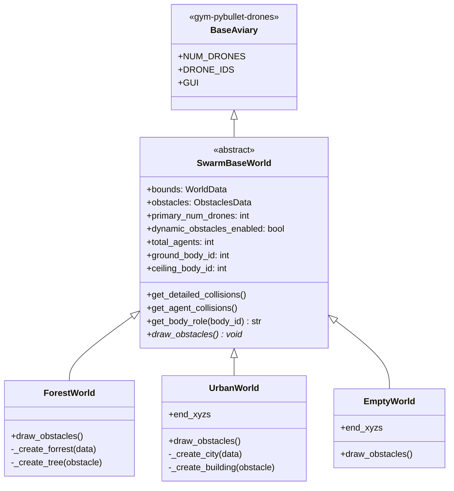

# src/environments/ — Srodowiska symulacji roju dronow

Katalog definiuje **srodowiska 3D** dla symulacji planowania trajektorii UAV.
Kazde srodowisko zawiera przeszkody statyczne, granice swiata (ground + ceiling)
oraz opcjonalnie dynamiczne przeszkody (drony-intruderzy). Konfigurowane
dynamicznie przez Hydra YAML.

## Struktura

```
src/environments/
├── SwarmBaseWorld.py                 # ABC — bazowa klasa swiata (extends BaseAviary)
├── ForestWorld.py                    # Las (przeszkody cylindryczne)
├── UrbanWorld.py                     # Miasto (przeszkody BOX)
├── EmptyWorld.py                     # Puste srodowisko (brak przeszkod)
├── abstraction/
│   ├── generate_world_boundaries.py  # WorldData dataclass + generator
│   └── generate_obstacles.py         # ObstaclesData, PlacementStrategy, strategie
└── obstacles/
    └── ObstacleShape.py              # Enum: BOX | CYLINDER
```

## Modele danych

### WorldData (`generate_world_boundaries.py`)

```python
@dataclass
class WorldData:
    dimensions: np.ndarray    # [width, length, height]
    min_bounds: np.ndarray    # [0, 0, ground_height]
    max_bounds: np.ndarray    # [width, length, height]
    bounds: np.ndarray        # [[xmin,xmax], [ymin,ymax], [zmin,zmax]] shape (3,2)
    center: np.ndarray        # (min_bounds + max_bounds) / 2
```

Generator: `generate_world_boundaries(width, length, height, ground_height) -> WorldData`

### ObstaclesData (`generate_obstacles.py`)

```python
class ObstaclesData(NamedTuple):
    data: NDArray[np.float64]    # (N, 6) macierz przeszkod
    shape_type: ObstacleShape    # BOX | CYLINDER

    @property
    def count(self) -> int:      # N = data.shape[0]
```

Format wiersza `data[i]`:
- **CYLINDER**: `[x, y, z, radius, height, 0.0]`
- **BOX**: `[x, y, z, length_x, width_y, height_z]`

### SizeParams (`generate_obstacles.py`)

```python
class SizeParams(TypedDict):
    height: float
    width: float
    length: NotRequired[float]    # tylko BOX
```

### ObstacleShape (`ObstacleShape.py`)

```python
class ObstacleShape(str, Enum):
    BOX = "BOX"           # length, width, height
    CYLINDER = "CYLINDER" # width (radius), height
```

Uwaga: `ObstacleShape` to **czysty enum** — nie zawiera metod geometrycznych.
Logika kolizji/odleglosci zyje w `algorithms/abstraction/trajectory/objective_constrains.py`.

### PlacementStrategy (Protocol)

```python
class PlacementStrategy(Protocol):
    def __call__(
        self, min_b, max_b, count,
        start_positions=None, target_positions=None,
        safe_radius=1.5, rng=None,
    ) -> NDArray[np.float64]: ...
```

## Strategie rozmieszczenia przeszkod

| Strategia | Algorytm | `safe_radius` default | Zastosowanie |
|-----------|----------|----------------------|--------------|
| `strategy_random_uniform` | Rejection sampling U(min, max) | 30.0 | ForestWorld |
| `strategy_grid_jitter` | Siatka + jitter (gaussian noise) + oversampling 2x | 15.0 | UrbanWorld |
| `strategy_empty` | Zwraca `empty((0, 3))` | — | EmptyWorld |

Wszystkie strategie przyjmuja `rng: np.random.Generator | int | None` dla
determinizmu eksperymentow. `SeedRegistry` wstrzykuje `seeds.rng("environment")`
przez `GenerationDataStrategy`.

### `generate_obstacles()` — glowna funkcja

```python
generate_obstacles(
    world: WorldData,
    n_obstacles: int,
    shape_type: ObstacleShape = BOX,
    placement_strategy: PlacementStrategy = strategy_random_uniform,
    size_params: SizeParams = {'height': 20.0, 'width': 5.0, 'length': 5.0},
    start_positions=None,
    target_positions=None,
    safe_radius: float = 15.0,
    rng=None,
) -> ObstaclesData
```

Pipeline:
1. Kopiuje world bounds, wymusza `z = 0` (przeszkody na ziemi)
2. Wola `placement_strategy()` -> pozycje `(N, 3)`
3. Dopisuje wymiary per `shape_type` -> `(N, 6)`
4. Zwraca `ObstaclesData(data, shape_type)`

## SwarmBaseWorld — Klasa bazowa (ABC)

Dziedziczy z `gym_pybullet_drones.envs.BaseAviary` (Gymnasium).
Nie jest instancjowana bezposrednio — sluzy jako baza dla Forest/Urban/EmptyWorld.

### Konstruktor

```python
SwarmBaseWorld(
    world_data: WorldData,
    obstacles_data: ObstaclesData,
    num_drones: int | None = None,
    primary_num_drones: int | None = None,
    dynamic_obstacles_enabled: bool = False,
    num_dynamic_obstacles: int = 0,
    initial_xyzs=None,
    initial_rpys=None,
    **kwargs    # filtrowane do bezpiecznych kluczy BaseAviary
)
```

`**kwargs` filtrowane przez `inspect.signature(BaseAviary.__init__)` — zapobiega
przekazywaniu nieznanych parametrow Hydra do BaseAviary.

### Dynamic obstacles (drony-intruderzy)

System rozroznia **primary drones** (agenci kontrolowani przez planer trajektorii)
od **dynamic obstacles** (dodatkowi agenci PyBullet sluzacy jako ruchome przeszkody):

```
total_agents = primary_num_drones + num_dynamic_obstacles
indices [0, primary_num_drones)           -> primary drones
indices [primary_num_drones, total_agents) -> dynamic obstacles
```

### Role system

| Metoda | Zwraca | Opis |
|--------|--------|------|
| `get_primary_agent_indices()` | `list[int]` | Indeksy glownych dronow |
| `get_dynamic_obstacle_indices()` | `list[int]` | Indeksy dynamicznych przeszkod |
| `is_dynamic_obstacle(agent_idx)` | `bool` | Czy agent to przeszkoda dynamiczna |
| `get_agent_index_from_body_id(body_id)` | `int \| None` | PyBullet body ID -> agent index |
| `get_body_role(body_id)` | `str` | "drone" / "dynamic_obstacle" / "ground" / "ceiling" / "static_obstacle" |

### Collision detection

```python
get_detailed_collisions(include_dynamic_obstacles=False)
    -> list[(agent_idx, other_body_id)]

get_agent_collisions(include_dynamic_obstacles=False)
    -> list[(agent_idx, other_agent_idx)]
```

Uzywa `p.getContactPoints(bodyA=agent_body_id)`. Domyslnie raportuje
kolizje tylko dla primary drones.

### World geometry (PyBullet)

| Metoda | Opis |
|--------|------|
| `_clear_default_plane()` | Usuwa domyslna plane.urdf z BaseAviary |
| `_create_ground(color, thickness)` | Tworzy ground box na `ground_position` |
| `_create_ceiling()` | Tworzy polprzezroczysty sufit na `height` (jesli > 0) |
| `_setup_environment(ground_color)` | Ground + ceiling (wolana z `_addObstacles`) |

### Gymnasium stubs

`_actionSpace()`, `_observationSpace()`, `_computeObs()`, `_preprocessAction()`,
`_computeReward()`, `_computeTerminated()`, `_computeTruncated()`, `_computeInfo()`
— minimalne implementacje wymagane przez BaseAviary/Gymnasium. Symulacja nie
uzywa RL reward/terminated — te stuby spelniaja kontrakt interfejsu.

### Abstrakcja

```python
@abstractmethod
def draw_obstacles(self) -> None: ...
```

Kazda podklasa implementuje rysowanie przeszkod specyficznych dla srodowiska.

## Implementacje srodowisk

Wszystkie podklasy maja wspolna sygnature konstruktora:

```python
XxxWorld(
    world_data, obstacles_data,
    num_drones=None, drone_model=CF2X, physics=PYB,
    initial_xyzs=None, end_xyzs=None, initial_rpys=None,
    primary_num_drones=None,
    dynamic_obstacles_enabled=False, num_dynamic_obstacles=0,
    **kwargs
)
```

Kazda wola `sanitize_init_params()` z `src.utils.config_parser` (konwersja
typow Hydra: listy -> ndarray, stringi -> enum).

| Srodowisko | Przeszkody | Rysowanie | PyBullet geometry |
|------------|-----------|-----------|-------------------|
| **ForestWorld** | CYLINDER | `_create_forrest()` -> `_create_tree()` | `p.GEOM_CYLINDER` (zielone) |
| **UrbanWorld** | BOX | `_create_city()` -> `_create_building()` | `p.GEOM_BOX` (losowy shade szarosci) |
| **EmptyWorld** | brak | `print("[DEBUG]...")` (no-op) | — |

## Diagram klas



## Konfiguracja Hydra — przyklady

### UrbanWorld

```yaml
_target_: src.environments.UrbanWorld.UrbanWorld
name: "urban"
params:
  num_drones: 5
  track_length: 1000.0     # Y [m]
  track_width: 300.0        # X [m]
  track_height: 20.0        # Z [m]
  shape_type: 'BOX'
  placement_strategy: 'strategy_grid_jitter'
  obstacles_number: 27
  obstacle_length: 15.0
  obstacle_width: 15.0
  obstacle_height: 15.0
  safe_radius: 30.0
initial_xyzs: [[145,5,5], [150,5,5], [155,5,5], [160,5,5], [165,5,5]]
end_xyzs: [[145,995,5], [150,995,5], [155,995,5], [160,995,5], [165,995,5]]
```

### ForestWorld

```yaml
_target_: src.environments.ForestWorld.ForestWorld
name: "forest"
params:
  num_drones: 5
  track_length: 600.0
  track_width: 60.0
  track_height: 11.0
  shape_type: 'CYLINDER'
  placement_strategy: 'strategy_random_uniform'
  obstacles_number: 17
  obstacle_width: 1.0       # radius
  obstacle_height: 10.0
  safe_radius: 15.0
```

### EmptyWorld

```yaml
_target_: src.environments.EmptyWorld.EmptyWorld
name: "empty"
params:
  placement_strategy: null   # brak generowania przeszkod
```
