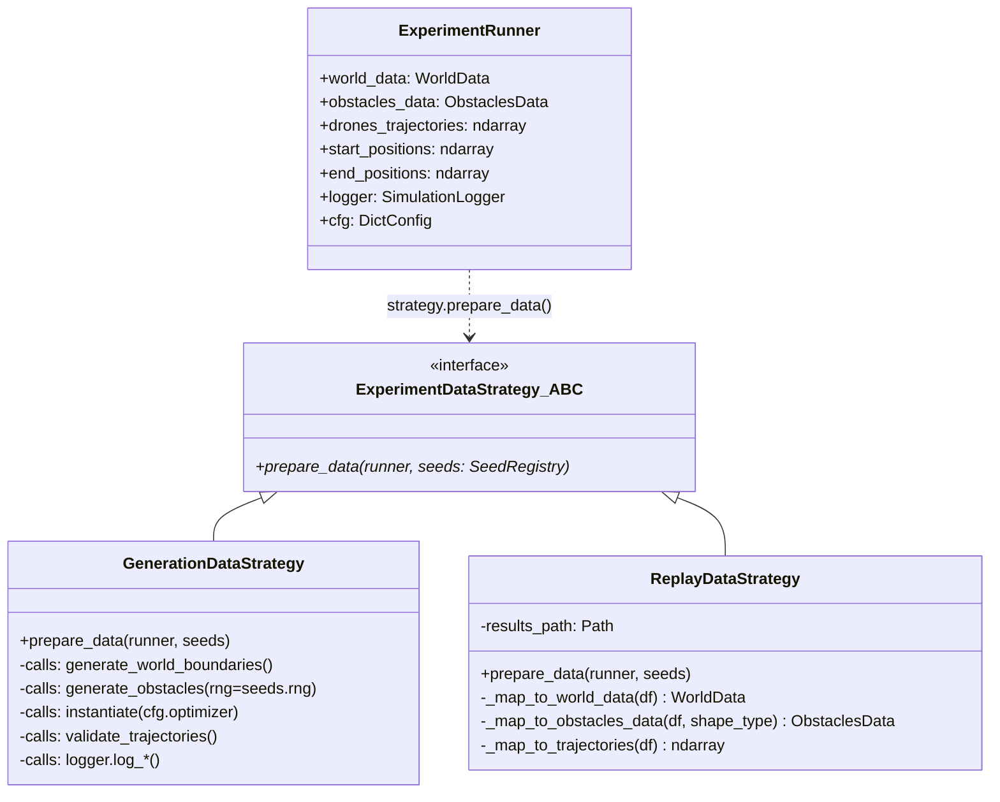

# src/runner/ — Strategie uruchomieniowe eksperymentow

Katalog zawiera **Strategy Pattern** dla roznych trybow uruchamiania symulatora
roju dronow. Implementuja abstrakcyjny interfejs `ExperimentDataStrategy`
z metoda `prepare_data(runner, seeds)`. Przelaczane przez CLI/Hydra.

**Glowne tryby:**
- **Generowanie nowych eksperymentow** (domyslne)
- **Odtwarzanie z archiwum** (`--replay /path/to/results`)

## Architektura

```
src/runner/
├── ExperimentDataStrategy.py     # ABC interfejs
├── GenerationDataStrategy.py     # Nowy eksperyment (offline optimization)
└── ReplayDataStrategy.py         # Replay z CSV (deserializacja)
```

## ExperimentDataStrategy — Interfejs bazowy

```python
from abc import ABC, abstractmethod
from typing import TYPE_CHECKING
from src.utils.SeedRegistry import SeedRegistry

if TYPE_CHECKING:
    from main import ExperimentRunner

class ExperimentDataStrategy(ABC):
    @abstractmethod
    def prepare_data(self, runner: "ExperimentRunner", seeds: SeedRegistry):
        pass
```

`SeedRegistry` zapewnia deterministyczne PRNG per-subsystem (np.
`seeds.rng("environment")` dla obstacle placement, `seeds` przekazywane
do counting_strategy). Import `ExperimentRunner` za `TYPE_CHECKING` guardiem
eliminuje cykliczna zaleznosc z `main.py`.

## GenerationDataStrategy — Nowy eksperyment

Tryb domyslny: generuje srodowisko + optymalizuje trajektorie offline.

### Pipeline (5 etapow)

```
1. generate_world_boundaries(width, length, height, ground_height)
      → runner.world_data: WorldData

2. generate_obstacles(world_data, n_obstacles, shape_type, placement_strategy,
                      size_params, start_positions, target_positions,
                      safe_radius, rng=seeds.rng("environment"))
      → runner.obstacles_data: ObstaclesData
      [warunkowy — tylko gdy runner.placement_strategy_name is not None]

3. instantiate(runner.cfg.optimizer) → counting_strategy
   functools.partial(counting_strategy, ..., seeds=seeds)
      → runner.drones_trajectories: ndarray (N_drones, N_wp, 3)

4. validate_trajectories(drones_trajectories, start_positions, label=opt_label)
      Sanity-check: drony stojace w starcie, zdegenerowane trajektorie.
      Loguje WARNING do stdout PRZED uruchomieniem PyBullet.

5. Archiwizacja (jezeli runner.logger is not None):
      logger.log_chosen_trajectories(drones_trajectories)
      logger.log_world_dimensions(world_data)
      logger.log_obstacles(obstacles_data)
```

### Kluczowe importy / zaleznosci

| Import | Zrodlo | Rola |
|--------|--------|------|
| `generate_world_boundaries` | `src.environments.abstraction` | Tunele misji |
| `generate_obstacles` | `src.environments.abstraction` | Predefiniowana liczba przeszkod |
| `get_placement_strategy` | `configs.environment.strategies` | `strategy_grid_jitter` / `random_uniform` |
| `validate_trajectories` | `src.utils.trajectory_validator` | Post-optimization sanity check |
| `hydra.utils.instantiate` | Hydra | DI counting_strategy z YAML |

Uwaga: `generate_world_boundaries`, `generate_obstacles` etc. to **funkcje
importowane**, nie metody klasy — cala logika zyje w `prepare_data()`.

## ReplayDataStrategy — Odtwarzanie eksperymentu

Aktywacja: `--replay /path/to/results`

### Konstruktor

```python
def __init__(self, results_path: str):
    self.results_path = Path(results_path)
```

### Deserializacja CSV -> struktury Python

```
results/
├── world_boundaries.csv      # WorldData (X,Y,Z -> min/max/center/bounds)
├── generated_obstacles.csv   # ObstaclesData (typ: CYLINDER/BOX)
└── counted_trajectories.csv  # Tensor [num_drones, num_waypoints, 3]
```

### Metody prywatne (prefiks `_`)

| Metoda | Input | Output | Uwagi |
|--------|-------|--------|-------|
| `_map_to_world_data(df)` | DataFrame (Axis, Min/Max/Center/Dimension) | `WorldData` | Sortowanie po Axis=[X,Y,Z], bounds=(3,2) |
| `_map_to_obstacles_data(df, shape_type_str)` | DataFrame + "CYLINDER"/"BOX" | `ObstaclesData` | CYLINDER: 5 kol -> pad z 0.0 do 6 kol (kanoniczny format) |
| `_map_to_trajectories(df)` | DataFrame (drone_id, waypoint_id, x, y, z) | `ndarray (N,W,3)` | Sortowanie per drone_id -> waypoint_id |

### Pipeline `prepare_data`

```
1. world_boundaries.csv → _map_to_world_data → runner.world_data
2. generated_obstacles.csv → _map_to_obstacles_data → runner.obstacles_data
3. counted_trajectories.csv → _map_to_trajectories → runner.drones_trajectories
4. Injection pozycji startowych/koncowych z tensora:
     runner.start_positions = drones_trajectories[:, 0, :]
     runner.end_positions   = drones_trajectories[:, -1, :]
   (odcina symulacje od losowych wartosci z YAML — 100% determinizm replay)
```

### Cylinder padding (CYLINDER → 6-kolumnowy format)

`ObstaclesData.data` ma kanoniczna postac `(N, 6)`. CSV dla lasu (CYLINDER)
zapisuje 5 kolumn (`x, y, z, radius, height` — `SimulationLogger` pomija
`unused_dim`). Deserializacja dopelnia szosta kolumne zerami:

```python
if shape_type == ObstacleShape.CYLINDER and data_matrix.shape[1] == 5:
    pad = np.zeros((data_matrix.shape[0], 1), dtype=np.float64)
    data_matrix = np.hstack([data_matrix, pad])
```

## Diagram Strategy Pattern + Runner



## Uzycie CLI/Hydra

```bash
# Nowy eksperyment (domyslny)
python main.py environment=urban optimizer=msffoa num_drones=5

# Replay
python main.py --replay ./results/2026-04-21_12-30-urban_msffoa/
```

## Przykladowy workflow eksperymentu

```
1. GenerationDataStrategy → CSV archiwum (world, obstacles, trajectories)
2. ReplayDataStrategy → Zaladowanie + symulacja online (sledzenie + avoidance)
3. Analiza: ETL → SQLite → metryki (src/analysis/)
4. Porownanie algorytmow (NSGA-III vs MSFOA vs SSA vs OOA)
```
