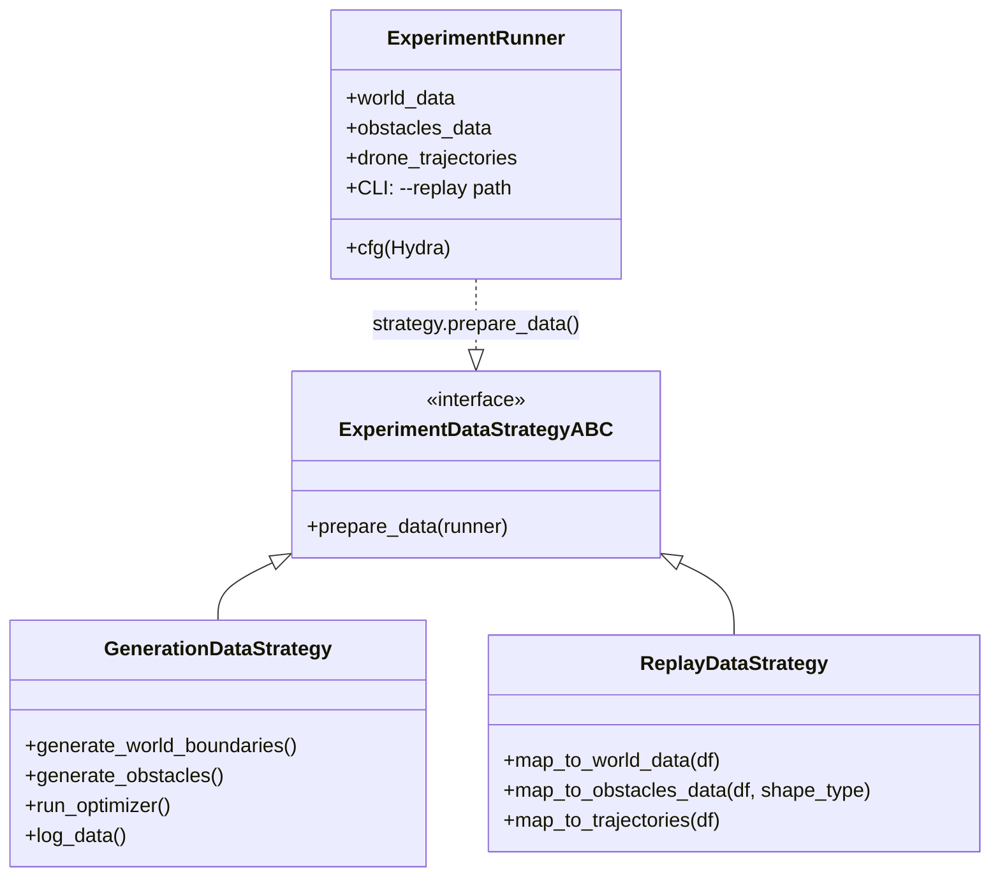

# src/runner/ — Strategie uruchomieniowe eksperymentów

Katalog zawiera **Strategy Pattern** dla różnych trybów uruchamiania symulatora roju dronów. Implementują abstrakcyjny interfejs `ExperimentDataStrategy` z metodą `prepare_data(runner: ExperimentRunner)`. Przełączane przez CLI/Hydra.

**Główne tryby:**
- **Generowanie nowych eksperymentów** (domyślne)
- **Odtwarzanie z archiwum** (`--replay /path/to/results`)

## 🏗️ Architektura

```
src/runner/
├── ExperimentDataStrategy.py     # ABC interfejs 
├── GenerationDataStrategy.py     # Nowy eksperyment 
└── ReplayDataStrategy.py         # Replay z CSV
```

**Interfejs bazowy** (`ExperimentDataStrategy`):
```python
from abc import ABC, abstractmethod
from main import ExperimentRunner

class ExperimentDataStrategy(ABC):
    @abstractmethod
    def prepare_data(self, runner: ExperimentRunner):
        pass
```

## 🎯 GenerationDataStrategy — Nowy eksperyment

**Tryb domyślny**: Generuje środowisko + optymalizuje trajektorie offline.

**Pipeline** (4 etapy):
1. **`generate_world_boundaries()`** — tunele misji (track_width×length×height)
2. **`generate_obstacles()`** — predefiniowana liczba przeszkód (`strategy_grid_jitter` / `random_uniform`)
3. **Uruchom algorytm** (`counting_strategy` z `algorithms/`)
4. **Archiwizacja** (CSV: world_boundaries, generated_obstacles, counted_trajectories)

```python
# Logi wykonania
INFO: "Generowanie nowego środowiska i optymalizacja trajektorii (Offline Path-Planning)"
TITLE: "1. Generowanie granic świata..."
TITLE: "2. Generowanie przeszkód..."
"Uruchamianie obliczeń algorytmu metaheurystycznego..."
TITLE: "4. Archiwizacja stanu początkowego"
```

**Integracja**: `hydra.utils.instantiate(runner.cfg.optimizer)`, `get_placement_strategy()`.

## 🔄 ReplayDataStrategy — Odtwarzanie eksperymentu

**Aktywacja**: `--replay /path/to/results`

**Deserializacja CSV** → struktury Python:
```
results/
├── world_boundaries.csv      # WorldData (X,Y,Z → min/max/center/bounds)
├── generated_obstacles.csv   # ObstaclesData (typ: CYLINDER/BOX)
└── counted_trajectories.csv  # Tensor [num_drones, num_waypoints, 3]
```

**Mapowanie**:
| CSV → Obiekt | Format | Walidacja |
|--------------|--------|-----------|
| `world_boundaries.csv` | `Axis: X/Y/Z → Min/Max/Center/Dimension` | Pandas → NumPy → `WorldData` |
| `obstacles.csv` | `x,y,z,radius/width,length,height` | Dynamiczne kolumny/prostopadłościany (CYLINDER/BOX) |
| `trajectories.csv` | `drone_id, waypoint_id, x,y,z` | Sortowane → Tensor `[N_drones, N_wp, 3]` |


## 🔄 Diagram Strategy Pattern + Runner



## 🚀 Użycie CLI/Hydra

```bash
# Nowy eksperyment (domyślny)
python main.py environment=urban optimizer=msffoa num_drones=5

# Replay 
python main.py --replay ./results/2026-04-21_12-30-urban_msffoa/
```


## 🧪 Przykładowy workflow eksperymentu

```
1. GenerationDataStrategy → CSV archiwum
2. ReplayDataStrategy → Załadowanie + symulacja online (śledzenie + avoidance)
3. Logi + wizualizacje (matplotlib/plotly)
4. Porównanie algorytmów (NSGA-III vs MSFOA)
```

## 📊 Zalety designu

✅ **Reużywalność**: Jedna struktura danych dla wszystkich trybów  
✅ **Deterministyczne replay**: 100% odtwarzalność eksperymentów  
✅ **Modularność**: Łatwe dodawanie strategii (np. `ParallelStrategy`)  
✅ **Debugging**: Archiwizacja pośrednich stanów optymalizacji
✅ **Skalowalność**: Obsługa różnych kształtów/strategii placement  

## 🛠️ Status rozwoju

✅ Pełna implementacja ABC + 2 strategie  
✅ Solidna deserializacja (CYLINDER/BOX)  
✅ Integracja z `environments/` i `algorithms/`  
⏳ Batch processing wielu replay  
⏳ Cloud storage (S3/MinIO) dla archiwów  

**Autor**: Edwin — Praca magisterska (walidacja algorytmów inspirowanych biologicznie dla roju UAV)  
**Wersja**: 1.0 (Kwiecień 2026)
