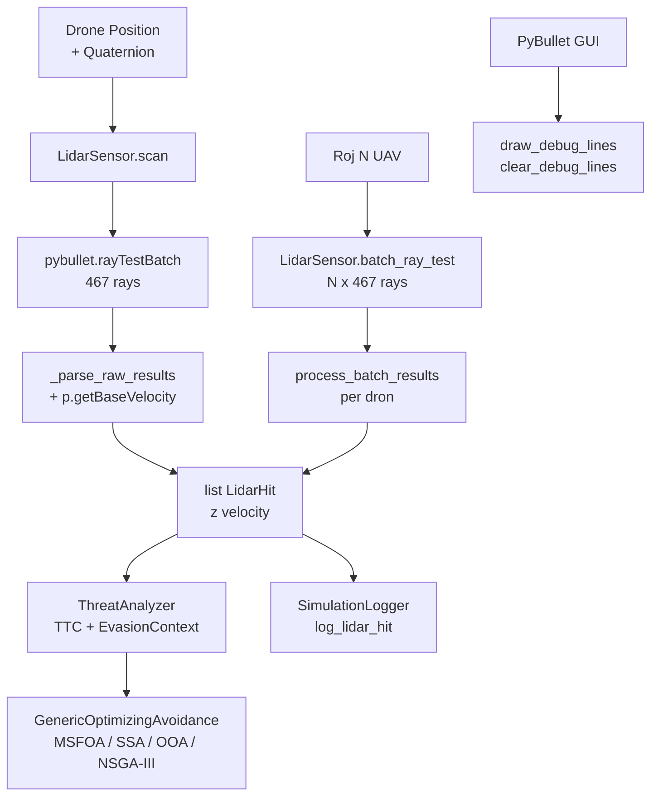

# src/sensors/ — Sensory symulacji UAV (LiDAR 3D)

Katalog implementuje **LiDAR 3D** dla fazy **online avoidance** w symulacji roju dronow.
Uzywa `pybullet.rayTestBatch()` do **ray casting** z optymalizacja batchowa dla wielu UAV.
Zintegrowany z PyBullet physics (C++ backend).

## Struktura

```
src/sensors/
├── __init__.py
├── LidarSensor.py          # Core sensor + velocity extraction
└── lidar_visualzation.py   # Demo + debug (standalone)
```

## LidarSensor — Specyfikacja techniczna

### Parametry skanowania (stozek spotlight FOV)

- **FOV**: 30 stopni rozwarcia (15 stopni od osi, przod drona CF2X)
- **Promienie**: **467** (12 koncentrycznych pierscieni)
- **Zasieg**: **100 m** (`MAX_RANGE`)
- **Batch**: `rayTestBatch()` — <1 ms dla 5 x 467 = 2335 promieni

### Pierscienie (`_compute_ray_directions()`)

Gestosc rosnie proporcjonalnie do obwodu pierscienia, co zapewnia staly
odstep katowy (~1.0-1.5 stopnia) w calym stozku:

```
R0:   0.0 deg ->   1 ray   (centralny)
R1:   0.5 deg ->   4 rays  (rdzen ochronny — male obiekty czolowe)
R2:   1.5 deg ->  10 rays
R3:   3.0 deg ->  18 rays
R4:   4.5 deg ->  26 rays
R5:   6.0 deg ->  34 rays
R6:   7.5 deg ->  42 rays
R7:   9.0 deg ->  50 rays
R8:  10.5 deg ->  58 rays
R9:  12.0 deg ->  66 rays
R10: 13.5 deg ->  74 rays
R11: 15.0 deg ->  84 rays  (krawedz FOV)
                  --------
                  467 total
```

Wektory bazowe sa obliczane raz (class-level lazy init `_base_ray_directions`)
i obracane per-skan przez `scipy.spatial.transform.Rotation.from_quat()` — pelna 6DoF.

Os Y = przod modelu CF2X: stala `FORWARD_AZIMUTH = 90 deg` przesuwa stozek
z domyslnej osi X na os Y.

### Dataclass `LidarHit`

```python
@dataclass(slots=True)
class LidarHit:
    object_id: int                       # PyBullet body ID (np. obstacle=1, ground=0)
    distance: float                      # m (= hit_fraction * MAX_RANGE)
    hit_position: NDArray[np.float64]    # [x,y,z] punkt trafienia w world frame
    ray_direction: NDArray[np.float64]   # jednostkowy wektor promienia (obrocony)
    velocity: NDArray[np.float64]        # [vx,vy,vz] predkosc obiektu (p.getBaseVelocity)
```

Pole `velocity` jest kluczowe dla systemu avoidance: `ConstantVelocityPredictor`
uzywa go do predykcji przyszlej pozycji przeszkody, a `ThreatAnalyzer` do
obliczenia TTC (Time-To-Collision).

## Kluczowe metody

| Metoda | Sygnatura | Opis |
|--------|-----------|------|
| `scan` | `(position, quat=None) -> list[LidarHit]` | Pojedynczy skan z rotacja |
| `batch_ray_test` | `(positions, physics_client_id, orientations_quat=None) -> list[tuple]` | Roj UAV (N x 467 rays) — static method |
| `process_batch_results` | `(raw_results, logger=None, current_time=0.0, drone_id=-1) -> list[LidarHit]` | Parse + opcjonalny log do SimulationLogger |
| `draw_debug_lines` | `(drone_position) -> None` | Wizualizacja (czerwony=hit, zielony=miss) |
| `clear_debug_lines` | `() -> None` | Usuwa debug lines z PyBullet GUI |

### Velocity extraction (`_parse_raw_results`)

Prywatna metoda wspolna dla `scan()` i `process_batch_results()`. Dla kazdego
trafienia (obj_id != -1) wola `p.getBaseVelocity(obj_id)` by pobrac predkosc
liniowa obiektu z silnika fizycznego. Fallback na `zeros(3)` dla obiektow
czysto statycznych (siatki bez cial sztywnych — `p.error`).

```python
try:
    linear_vel, _ = p.getBaseVelocity(obj_id, physicsClientId=...)
    velocity_vector = np.array(linear_vel, dtype=np.float64)
except p.error:
    velocity_vector = np.zeros(3, dtype=np.float64)
```

### `batch_ray_test` — batch dla roju

Metoda statyczna. Przyjmuje tablice pozycji `(N, 3)` i opcjonalnych quaternionow
`(N, 4)`. Obraca bazowe wektory per-dron i laczy w jeden mega-batch
`rayTestBatch()`. Zwraca surowe wyniki PyBullet — parsowanie przez
`process_batch_results()` per-dron.

```python
raw = LidarSensor.batch_ray_test(all_positions, client_id, all_quats)
# raw to flat list — slice per dron: raw[i*467 : (i+1)*467]
```

## lidar_visualzation.py — Demo

Standalone skrypt testowy (nie importowany przez glowna symulacje):

```
1. PyBullet GUI + plane.urdf + cube.urdf (useFixedBase=True)
2. Drone @ [0,0,1m] -> skanuje cube @ [5,0,1m]
3. Debug lines: czerwony=hit, zielony=miss
4. Logi: "Trafiono szescian! Dystans: X.XX m"
```

Uwaga: demo uzywa starszego API (`lidar._ray_directions`) — moze wymagac
aktualizacji do `LidarSensor._base_ray_directions`.

## Diagram integracji



## Uzycie w symulacji

```python
# Pojedynczy dron
lidar = LidarSensor(client_id)
hits = lidar.scan(drone_pos, drone_quat)
for hit in hits:
    print(f"obj={hit.object_id}, d={hit.distance:.1f}m, v={hit.velocity}")

# Roj (batch)
raw = LidarSensor.batch_ray_test(all_positions, client_id, all_quats)
num_rays = LidarSensor._num_rays  # 467
for i in range(n_drones):
    chunk = raw[i * num_rays : (i + 1) * num_rays]
    drone_hits = lidar.process_batch_results(chunk, logger, t, drone_id=i)

# Debug wizualny
lidar.draw_debug_lines(drone_pos)
lidar.clear_debug_lines()
```

## Wydajnosc

| Konfiguracja | Promienie/krok | Czas CPU (szacunkowy) |
|--------------|----------------|-----------------------|
| 1 UAV | 467 | <0.2 ms |
| 5 UAV | 2 335 | <1 ms |
| 20 UAV | 9 340 | ~3-4 ms |

Optymalizacja: C++ backend PyBullet (`rayTestBatch` — AABB broadphase + GJK narrowphase),
wektoryzacja NumPy. Class-level caching `_base_ray_directions` eliminuje
ponowne obliczanie stozka przy kazdym skanie.

## Zastosowanie w pracy magisterskiej

- **Online avoidance**: `LidarHit` -> `ThreatAnalyzer` -> `EvasionContext` -> optimizer-based avoidance (MSFOA/SSA/OOA/NSGA-III)
- **Velocity prediction**: `LidarHit.velocity` -> `ConstantVelocityPredictor` -> predykowana pozycja przeszkody w horyzoncie czasowym
- **Metryki bezpieczenstwa**: min distance do przeszkod, TTC (Time-To-Collision)
- **Replay walidacja**: logi LiDAR w CSV przez `SimulationLogger.log_lidar_hit()`
