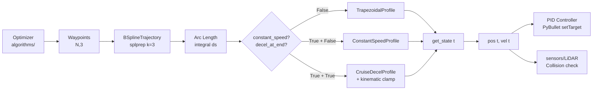

# src/trajectory/ — Generatory trajektorii UAV (B-Spline + Profile)

Katalog implementuje **gladkie trajektorie 3D** dla fazy **online tracking** + **local avoidance**. Kluczowy element miedzy optymalizatorem (`algorithms/`) a kontrolerem PID. Zapewnia **ciaglosc pozycji/predkosci/przyspieszenia**.

## Struktura

```
src/trajectory/
├── BSplineTrajectory.py     # Glowna klasa (scipy.interpolate)
├── TrapezoidalProfile.py    # Trapez (globalne misje)
├── ConstantSpeedProfile.py  # Stala predkosc (unikanie przeszkod, legacy)
└── CruiseDecelProfile.py    # Cruise + rampa hamowania (unikanie, Bug #2 fix)
```

## BSplineTrajectory — Core generator

**Input**: Waypoints z optymalizatora `(N,3)` -> **Cubic B-Spline** (`k=3`, interpolacja `s=0`).

**Pipeline**:
1. `splprep()` -> parametry krzywej `(tck, u)`
2. `_calculate_arc_length()` -> calkowita dlugosc (numeryczne calkowanie, 1000 probek)
3. **Velocity Profile** -> mapuje czas -> `(pos, vel)`
4. **Analityczne pochodne** (`splev(der=1)`) -> wektor styczny x skalarna predkosc

**API**:
```python
traj = BSplineTrajectory(waypoints, cruise_speed=5.0, max_accel=2.0)
pos, vel = traj.get_state_at_time(t=10.5)        # (3,), (3,)
pos, vel = traj.get_state_at_distance(s=50.0, speed=3.0)
```

**Parametry konstruktora**:

| Parametr | Typ | Default | Opis |
|---|---|---|---|
| `waypoints` | `np.ndarray (N,3)` | — | Punkty trasy z optymalizatora |
| `cruise_speed` | `float` | — | Maksymalna predkosc przelotowa [m/s] |
| `max_accel` | `float` | — | Maksymalne przyspieszenie [m/s^2] |
| `constant_speed` | `bool` | `False` | `True` -> profil bez fazy startu z v=0 (avoidance) |
| `decel_at_end` | `bool` | `False` | Modyfikator do `constant_speed=True`: cruise + rampa hamowania zamiast step v->0 |

**Selekcja profilu predkosci** (3 sciezki):

```python
if constant_speed and decel_at_end:
    # Kinematic safety clamp + CruiseDecelProfile
    safe_cruise, safe_decel = _kinematic_safe_profile_params(tck, ...)
    profile = CruiseDecelProfile(arc_length, safe_cruise, safe_decel)
elif constant_speed:
    profile = ConstantSpeedProfile(arc_length, cruise_speed)
else:
    profile = TrapezoidalProfile(arc_length, cruise_speed, max_accel)
```

**Eksponowane atrybuty** (uzywane downstream, np. `WeightedSumFitness._curvature_cost`):
- `self.cruise_speed` — predkosc przelotowa [m/s]
- `self.max_accel` — max przyspieszenie [m/s^2]
- `self.arc_length` — calkowita dlugosc krzywej [m]
- `self.total_duration` — czas przelotu [s]
- `self.waypoints` — oryginalne waypoints (sparse)
- `self.kinematic_clamp` — (tylko `decel_at_end=True`) dict z `requested_cruise`, `applied_cruise`, `applied_decel`

## Kinematic Safety Clamp (`_kinematic_safe_profile_params`)

Statyczna metoda `BSplineTrajectory` obliczajaca bezpieczna predkosc przelotowa
i effective decel na podstawie analizy krzywizny B-Spline. Aktywna tylko
w sciezce `constant_speed=True, decel_at_end=True`.

**Fizyka** (Frenet-Serret):
```
kappa = ||r' x r''|| / ||r'||^3          # krzywizna 3D
a_lateral = v^2 * kappa                   # przyspieszenie centrypetalne
a_longitudinal = v'                       # przyspieszenie styczne (z profilu)
|a_total| = sqrt(a_lat^2 + a_long^2)     # <= max_accel
```

**Strategia budzetowania**:
- `curvature_safety_factor = 0.5` — polowa budz. accel na lateral
- `v_safe = sqrt(S * max_accel / kappa_max)` — max bezpieczna predkosc
- `effective_decel = sqrt(max_accel^2 - actual_lateral^2)` — residual budzet na hamowanie
- Jezeli `requested_cruise < v_safe` — nie klamrujemy

**Probkowanie**: 100 punktow w `u in [0.05, 0.95]` (pomijamy brzegi, gdzie
krzywizna splprep jest niestabilna numerycznie).

## Velocity Profiles — Komponenty

| Profil | Zastosowanie | Charakterystyka | Przyspieszenie | Ciaglosc v |
|--------|--------------|-----------------|----------------|------------|
| **TrapezoidalProfile** | Globalne misje | Accel -> Cruise -> Decel | `max_accel` [m/s^2] | C^0 (skok jerk) |
| **ConstantSpeedProfile** | Unikanie (legacy) | Staly `cruise_speed` | 0 | Nieciagly step v->0 na koncu |
| **CruiseDecelProfile** | Unikanie (aktualny) | Cruise -> Decel ramp | `max_accel` [m/s^2] | Ciagly (rampa do v_end) |

### TrapezoidalProfile (auto-adaptive)
```
Krotka trasa -> trojkatny (v_peak = sqrt(a * s))
Dluga trasa  -> trapezowy (v_peak = cruise_speed)
Fazy: t_a/s_a -> t_c/s_c -> t_d/s_d
get_state(t) -> (distance, speed)
```

### ConstantSpeedProfile (legacy)
```
v(t) = cruise_speed   dla t in [0, total_duration)
v(total_duration) = 0  (instantaneous step)
```
Stosowany gdy `constant_speed=True, decel_at_end=False`. Nieciagly skok
predkosci na koncu trajektorii moze generowac eksplozje `|a|(t)` w
finite-diff metrykach (Bug #2 plan.md).

### CruiseDecelProfile (Bug #2 fix)
```
v(0)            = cruise_speed
v(t_c)          = cruise_speed       (koniec fazy cruise)
v(t_c + t_d)    = v_end              (koniec fazy decel)
t_d             = cruise / max_accel (czas hamowania)
s_d             = 0.5 * cruise * t_d (dystans hamowania)
```
**Edge case** (krotka trasa, `total_distance < s_d_full`): brak miejsca na
pelne hamowanie do v=0. Konczymy z `v_end = sqrt(v^2 - 2*a*s) > 0`.
Resztkowy step `v_end -> 0` wymaskowany przez `MODE_REJOIN_BLEND`
w `SwarmFlightController` (~0.6 s ramp PID).

## Diagram integracji



## Przykladowe uzycie

```python
# Global mission (NSGA-III waypoints)
waypoints = np.array([[0,0,5], [10,5,8], [20,0,5]])
traj = BSplineTrajectory(waypoints, cruise_speed=5.0, max_accel=2.0)

# PID loop
for t in np.linspace(0, traj.total_duration, 1000):
    target_pos, target_vel = traj.get_state_at_time(t)
    pid.set_target(target_pos, target_vel)  # PyBullet

# Local avoidance — legacy (step v->0)
local_traj = BSplineTrajectory(short_waypoints, cruise_speed=3.0,
                               max_accel=2.0, constant_speed=True)

# Local avoidance — z rampa hamowania (zalecany)
local_traj = BSplineTrajectory(short_waypoints, cruise_speed=3.0,
                               max_accel=2.0, constant_speed=True,
                               decel_at_end=True)
# Sprawdz kinematic clamp:
print(local_traj.kinematic_clamp)
# {"requested_cruise": 3.0, "applied_cruise": 2.7, "applied_decel": 1.8}
```

## Metryki jakosci

| Metoda | Ciaglosc | Zastosowanie | Zlozonosc |
|--------|----------|--------------|-----------|
| **B-Spline (k=3)** | **C^2** (pos, vel, accel) | Global + local | O(N log N) |
| **Trapezoidal** | C^0 (skok jerk) | Dlugie misje | O(1) |
| **Constant** | C^0 (step na koncu) | Unik (legacy) | O(1) |
| **CruiseDecel** | C^0 (jerk na granicy cruise/decel) | Unik (zalecany) | O(1) |

**Arc length**: Numeryczne (1000 probek) — blad <0.1% dla cubic splines.

## Zastosowanie w systemie

1. **Offline -> Online**: waypoints z optymalizatora -> B-Spline tracking
2. **PID input**: `(target_pos, target_vel)` na kazdym tick
3. **LiDAR feedback**: Korekta z `sensors/` + `algorithms/avoidance/`
4. **Avoidance splines**: `SingleArcDeflection` generuje waypoints -> `BSplineTrajectory(decel_at_end=True)`
5. **Replay walidacja**: Porownanie symulacji z planem
