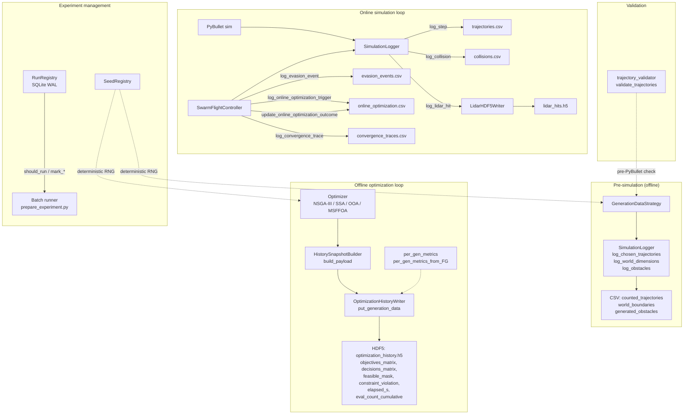

# src/utils/ — Infrastruktura logowania, reprodukowalnosci i narzedzi pomocniczych

Katalog zawiera **17 modulow** tworzacych infrastrukture reproducible research
dla pipeline'u symulacji roju dronow. Obejmuje: centralny system logowania
(SimulationLogger + asynchroniczne writery HDF5), rejestr deterministycznych
ziaren losowych (SeedRegistry), sledzenie eksperymentow (RunRegistry),
walidacje trajektorii, oraz kontrakty danych dla metryk optymalizacji online.

## Struktura

```
src/utils/
├── SimulationLogger.py             # Centralny logger — 7 buforow RAM -> CSV/HDF5
├── optimization_history_writer.py  # Async producer-consumer: historia ewolucji -> HDF5/npz
├── lidar_log_writer.py             # Async producer-consumer: trafienia LiDAR -> HDF5/npz
├── HistorySnapshotBuilder.py       # Builder payloadu per-generation dla OptimizationHistoryWriter
├── optimization_metrics.py         # Dataclasses: OnlineOptimizationRecord, ConvergenceSample
├── per_gen_metrics.py              # Helpery per-generation (F+G -> feasible_mask, CV, NFE)
├── SeedRegistry.py                 # Deterministyczny PRNG per-subsystem (SeedSequence)
├── RunRegistry.py                  # SQLite rejestr eksperymentow (PENDING/STARTED/COMPLETED/FAILED)
├── trajectory_validator.py         # Post-optimization sanity check (NaN, stuck, near-zero)
├── config_parser.py                # Konwersja typow Hydra -> struktury Python (sanitize_init_params)
├── postions_to_tensor.py           # List[List[float]] -> NDArray[N,3]
├── save_obstacles_to_csv.py        # ObstaclesData -> CSV (via HydraConfig output_dir)
├── ValidationMessage.py            # Enum z szablonami komunikatow walidacji
├── input_utils.py                  # Keyboard handler GUI PyBullet (SPACE/L/0-9)
├── pybullet_utils.py               # update_camera_position (PyBullet debug camera)
├── plot_trajectories.py            # CLI wizualizacja 3D trajektorii (matplotlib)
└── __init__.py
```

---

## SimulationLogger — Centralny system logowania

Buforuje dane w RAM i flushuje na dysk po zakonczeniu symulacji (`save()`).
Obsluguje 7 niezaleznych buforow i deleguje zapis LiDAR do dedykowanego
`LidarHDF5Writer`.

### Konstruktor

```python
SimulationLogger(
    output_dir: str,
    log_freq: int,
    ctrl_freq: int,
    num_drones: int,
    log_lidar_hits: bool = False,
)
```

- `log_step_interval = max(1, int(ctrl_freq / log_freq))` — decimation factor
- `run_id` — domyslnie `os.path.basename(output_dir)`, nadpisywalny przez integrator

### Bufory i pliki wyjsciowe

| Bufor | Plik CSV/HDF5 | Naglowki |
|-------|---------------|----------|
| `trajectory_buffer` | `trajectories.csv` | time, drone_id, x, y, z, roll, pitch, yaw, vx, vy, vz |
| `collision_buffer` | `collisions.csv` | time, drone_id, other_body_id |
| `evasion_buffer` | `evasion_events.csv` | 22 pola: time, drone_id, event_type, mode, ttc, ttc_source, dist_to_threat, threat_{x,y,z}, threat_{vx,vy,vz}, rejoin_{x,y,z}, rejoin_arc, preferred_axis, fallback_used, pos_error_at_rejoin, vel_error_at_rejoin, planning_wall_time_s, notes |
| `optimization_timing_buffer` | `optimization_timings.csv` | run_id, algorithm_name, stage_name, wall_time_s, cpu_time_s, success, n_drones, number_of_waypoints, population_size, max_generations, extra_params_json, created_at_utc |
| `online_optimization_buffer` | `online_optimization.csv` | Pola z `OnlineOptimizationRecord` (17 kolumn) |
| `convergence_traces_buffer` | `convergence_traces.csv` | Pola z `ConvergenceSample` (6 kolumn) |
| _(delegowany)_ `_lidar_writer` | `lidar_hits.h5` | time, drone_id, object_id, distance, hit_x, hit_y, hit_z |

### Metody logowania online

```python
log_step(step_idx, current_time, all_states)
    # Decimated: co log_step_interval krokow
    # Pomija drony w crashed_drones

log_collision(current_time, drone_id, other_body_id)
    # Ignoruje t < 1s (artefakty inicjalizacji)
    # Oznacza drona jako crashed (first-collision semantics)

log_lidar_hit(current_time, drone_id, hit)
    # Deleguje do LidarHDF5Writer.put() (async)
    # Warunkowo: tylko gdy log_lidar_hits=True

log_evasion_event(*, current_time, drone_id, event_type, mode, ttc,
                  ttc_source, dist_to_threat, threat_pos, threat_vel,
                  rejoin_point, rejoin_arc, preferred_axis, fallback_used,
                  pos_error_at_rejoin, vel_error_at_rejoin,
                  planning_wall_time_s, notes, astar_success=None)
    # Rekord diagnostyczny fazy uniku
    # astar_success: DEPRECATED (backward-compat -> fallback_used negacja)

log_online_optimization_trigger(record: OnlineOptimizationRecord)
    # Per-trigger summary; outcome = "pending" do BLEND_END/collision

update_online_optimization_outcome(*, drone_id, trigger_time, outcome,
                                   pos_err_at_rejoin_m, vel_err_at_rejoin_mps,
                                   time_to_rejoin_s)
    # Wypelnia grupe D in-place po PK (drone_id, trigger_time)
    # Tolerancja PK: 1e-6 s (_PK_FLOAT_TOL_S)

log_convergence_trace(*, run_id, drone_id, trigger_time, algorithm, trace)
    # Long-format: 1 wiersz/generacje. Pusty trace -> zero rekordow

log_optimization_timing(*, run_id, algorithm_name, stage_name,
                        wall_time_s, cpu_time_s, success, ...)
    # Pomiary czasu per-stage (offline + online)
```

### Metody archiwizacji (pre-simulation)

```python
log_chosen_trajectories(trajectories: NDArray)
    # -> counted_trajectories.csv (drone_id, waypoint_id, x, y, z)

log_world_dimensions(world: WorldData)
    # -> world_boundaries.csv (Axis, Dimension, Min_Bound, Max_Bound, Center)

log_obstacles(obstacles: ObstaclesData)
    # -> generated_obstacles.csv (BOX: x,y,z,length,width,height | CYLINDER: x,y,z,radius,height)
```

### Konwersja do DataFrame

- `_trajectory_to_dataframe(trajectory)` — (n_drones, n_wp, 3) -> DataFrame via meshgrid
- `_obstacles_to_dataframe(obstacles)` — ObstaclesData -> DataFrame (CYLINDER: drop unused_dim)
- `_world_to_dataframe(world)` — WorldData -> DataFrame indexed by [X, Y, Z]

---

## OptimizationHistoryWriter — Async zapis historii ewolucji

Wzorzec producent-konsument (thread-safe) dla zapisu per-generation
danych z optymalizacji offline. Referencja: Hansen et al. (2009) "Comparing
Results of 31 Algorithms from the BBOB-2009", GECCO Companion — NFE jako
standard porownywania algorytmow meta-heurystycznych.

### Konstruktor

```python
OptimizationHistoryWriter(output_dir: str)
```

- `_queue: Queue(maxsize=200)` — bounded queue
- `_BUFFER_FLUSH_SIZE = 100` — flush co 100 generacji
- Watek daemon `_consumer_loop` startuje natychmiast

### Public API

```python
put_generation_data(data: dict) -> None
    # Enqueue snapshot (block=True, timeout=5s)
    # data keys: objectives_matrix, decisions_matrix, feasible_mask,
    #            constraint_violation, elapsed_s, eval_count_cumulative, ...

close() -> None
    # Poison pill + join + final flush
```

### Backend zapisu

| Backend | Plik | Kompresja | Warunek |
|---------|------|-----------|---------|
| HDF5 | `optimization_history.h5` | gzip level 4 | `h5py` dostepne |
| NPZ | `optimization_history_npz/chunk_NNNN_TIMESTAMP.npz` | `np.savez_compressed` | fallback |

HDF5: datasety rozszerzalne (`maxshape=(None, ...)`), `np.stack` zachowuje
wymiar generacji (Generacja x Osobnik x Cechy). Resize + append per flush.

---

## LidarHDF5Writer — Async zapis trafien LiDAR

Analogiczny wzorzec producent-konsument jak OptimizationHistoryWriter, ale
zoptymalizowany pod ogromna liczbe drobnych rekordow (7 skalarow/rekord).

### Konstruktor

```python
LidarHDF5Writer(output_dir: str)
```

- `_queue: Queue(maxsize=2000)`
- `_LIDAR_FLUSH_SIZE = 100_000` — wiekszy bufor (rekordy male)

### Public API

```python
put(record: tuple) -> None
    # record = (time, drone_id, object_id, distance, hit_x, hit_y, hit_z)
    # block=True, timeout=2s; Queue.Full -> drop (nie blokuje symulacji)

close() -> None
    # Sentinel + join + final flush
```

### Backend zapisu

| Backend | Plik | Dtype | Chunks |
|---------|------|-------|--------|
| HDF5 | `lidar_hits.h5` dataset `"hits"` | `float32` | (4096, 7) |
| NPZ | `lidar_hits_npz/chunk_NNNN.npz` | `float32` | fallback |

Kolumny zapisane jako atrybut HDF5: `ds.attrs["columns"] = COLUMNS`.

---

## HistorySnapshotBuilder — Builder payloadu per-generation

Fasada upraszczajaca budowe dict-payloadu dla `OptimizationHistoryWriter`.
Uzywany przez strategie SOO (SSA, OOA, MSFFOA) ktore nie maja natywnego
pymoo callback'u.

### Konstruktor

```python
HistorySnapshotBuilder(
    *,
    history_writer: OptimizationHistoryWriter | None,
    logger: logging.Logger | None = None,
    label: str = "OPT",
)
```

### Metody

```python
write(payload: dict[str, np.ndarray]) -> None
    # Deleguje do history_writer.put_generation_data() (no-op gdy writer=None)

build_payload(
    *,
    decisions: NDArray,
    scalar_fitness: NDArray,
    objectives: NDArray | None = None,
    gen: int | None = None,
    gen_start_time: float | None = None,
    fitness_owner: Any = None,
    evaluator_out: dict | None = None,
    extras: dict | None = None,
    leader_decisions: NDArray | None = None,
    leader_scalar_fitness: NDArray | None = None,
    global_best_scalar_fitness: float | None = None,
) -> dict[str, np.ndarray]
    # Buduje payload z: decisions_matrix, scalar_fitness, objectives_matrix,
    #   best_idx, best_solution, best_scalar_fitness, best_objectives
    # Opcjonalnie: generation, elapsed_s, feasible_mask, feasible_count,
    #   feasible_ratio, constraints_matrix, constraint_violation_matrix,
    #   total_constraint_violation, weakest_constraint_violation,
    #   leader_decisions_matrix, leader_scalar_fitness, global_best_scalar_fitness

evaluate_problem_state(*, problem, decisions_2d) -> dict
    # Side-channel: re-evaluate via problem._decode_inner + evaluator
```

Wewnetrzne helpery:
- `_flatten_population(pop)` — ndim>=3 -> reshape(shape[0], -1)
- `_get_cached_attr(owner, names)` — odczyt atrybutow z fallback chain
- `_extract_feasible_mask(evaluator_out, fitness_owner)` — szuka w dict lub owner
- `_extract_constraints_matrix(evaluator_out, fitness_owner)` — G matrix
- `_extract_constraint_violation(evaluator_out, fitness_owner)` — CV vector

---

## optimization_metrics.py — Kontrakty danych optymalizacji online

Dataclasses zapewniajace wspolny schemat logowania metryk optymalizacji
online dla wszystkich 4 algorytmow avoidance (NSGA3, OOA, SSA, MSFFOA).
Referencja: Mehdi (2017), Bing et al. (2018) — standard raportowania
`evaluations_completed`, `wallclock_s`, `best_fitness`, `success_rate`.

### OnlineOptimizationRecord

Per-trigger summary wypelniany w 2 etapach:
1. **Plan built** — identyfikacja + grupa A (optimizer summary) + grupa B (decision)
2. **BLEND_END / collision** — grupa D (outcome) via `update_online_optimization_outcome`

PK = `(drone_id, trigger_time)`.

```python
@dataclass
class OnlineOptimizationRecord:
    # Identyfikacja
    run_id: str
    drone_id: int
    trigger_time: float          # PK
    algorithm: str               # SSA / OOA / MSFOA / NSGA3

    # Grupa A — optimizer summary
    status: str                  # ok / timed_out / failed
    reason: str                  # ok / no_feasible / budget_exceeded / ...
    best_fitness: float
    evaluations_completed: int
    generations_completed: int
    wallclock_s: float
    time_budget_s: float

    # Grupa B — decision
    chosen_axis: str = ""        # right/left/up/down/none
    plan_waypoints_json: str = ""
    plan_total_duration_s: float = NaN
    plan_arc_length_m: float = NaN

    # Grupa D — outcome (sentinel -> wypelniane pozniej)
    outcome: str = "pending"     # rejoined_ok / collided_* / never_rejoined
    pos_err_at_rejoin_m: float = NaN
    vel_err_at_rejoin_mps: float = NaN
    time_to_rejoin_s: float = NaN
```

### ConvergenceSample

Long-format: N rekordow per trigger (1 wiersz/generacje).
FK do `OnlineOptimizationRecord` przez `(drone_id, trigger_time)`.

```python
@dataclass
class ConvergenceSample:
    run_id: str
    drone_id: int
    trigger_time: float          # FK
    algorithm: str
    generation: int              # 0-indexed
    best_fitness: float
```

### Sentinele outcome

```python
OUTCOME_PENDING       = "pending"
OUTCOME_REJOINED_OK   = "rejoined_ok"
OUTCOME_COLLIDED_GROUND   = "collided_ground"
OUTCOME_COLLIDED_DRONE    = "collided_drone"
OUTCOME_COLLIDED_OBSTACLE = "collided_obstacle"
OUTCOME_NEVER_REJOINED    = "never_rejoined"
```

### Utility

- `online_record_headers() -> List[str]` — nazwy kolumn CSV
- `convergence_sample_headers() -> List[str]`
- `record_to_dict(record) -> Dict[str, Any]` — `dataclasses.asdict`

---

## per_gen_metrics.py — Helpery per-generation (F+G -> metryki)

Ujednolica format danych zapisywanych do `optimization_history.h5` miedzy
strategiami (SSA, MSFFOA, OOA, NSGA-III). ETL oczekuje datasetow:
`objectives_matrix`, `decisions_matrix`, `feasible_mask`,
`constraint_violation`, `elapsed_s`, `eval_count_cumulative`.

Referencja: Hansen, Auger, Ros, Finck & Posik (2009) "Comparing Results of
31 Algorithms from the BBOB-2009", GECCO Companion §3.3 — NFE jako standard.

```python
FEASIBILITY_EPS = 1e-6  # Sigma max(0, G) <= eps => feasible

per_gen_metrics_from_FG(
    objectives: np.ndarray,       # (pop, n_obj)
    constraints: np.ndarray | None,  # (pop, n_g) lub None
    decisions: np.ndarray,        # (pop, n_var)
    elapsed_s: float,
    eval_count_cumulative: int,
) -> Dict[str, np.ndarray]
    # Returns: objectives_matrix, decisions_matrix, constraint_violation,
    #          feasible_mask, elapsed_s, eval_count_cumulative

per_gen_metrics_re_evaluate(
    evaluator: Any,
    decisions_for_eval: np.ndarray,
    decisions_for_log: np.ndarray,
    elapsed_s: float,
    eval_count_cumulative: int,
) -> Dict[str, np.ndarray]
    # Wariant z re-ewaluacja populacji (gdy F/G nie zacache'owane)
    # UWAGA: re-eval zwieksza NFE — przekazywac snapshot PRZED re-evalem
```

---

## SeedRegistry — Deterministyczny PRNG per-subsystem

Zapewnia reprodukowalnosc eksperymentow przez izolacje strumieni losowych.
Oparty na `np.random.SeedSequence.spawn()` — kazdy subsystem otrzymuje
niezaleznego potomka z gwarantowana niezaleznoscia statystyczna.

Referencja: O'Neill (2014) "PCG: A Family of Simple Fast Space-Efficient
Statistically Good Algorithms for Random Number Generation" — SeedSequence
bazuje na counter-based PRNG gwarantujacym brak korelacji miedzy spawnami.

```python
@dataclass
class SeedRegistry:
    master_seed: int

DEFAULT_SEED_NAMESPACES = [
    "global", "numba", "environment",
    "optimizer", "sampling", "avoidance",
]
```

### Public API

```python
seed(namespace: str) -> int
    # Deterministyczny int seed dla danego subsystemu

rng(namespace: str) -> np.random.Generator
    # Nowa instancja Generator (PCG64) — UWAGA: kazde wywolanie tworzy nowy

export() -> dict[str, int]
    # {namespace: seed_int} — dla logowania/reprodukcji
```

### Mechanizm

```
master_seed -> SeedSequence(master_seed)
            -> spawn(len(namespaces))
            -> children[i].generate_state(1)[0] -> seed per namespace
```

---

## RunRegistry — SQLite rejestr eksperymentow

Sluzy do sledzenia postepow batch'owych eksperymentow (np. grid sweep
4 algorytmy x 4 srodowiska x 100 seedow = 1600 runow). Bezpieczny
dla concurrency (WAL journal mode, check_same_thread=False).

### Schema

```sql
CREATE TABLE runs (
    id          INTEGER PRIMARY KEY AUTOINCREMENT,
    optimizer   TEXT NOT NULL,
    environment TEXT NOT NULL,
    avoidance   TEXT NOT NULL,
    seed        INTEGER NOT NULL,
    status      TEXT NOT NULL DEFAULT 'PENDING',
    started_at  TEXT,
    finished_at TEXT,
    error_msg   TEXT,
    -- Opcjonalne (po reconcile):
    optimization_path   TEXT,
    motion_observed     INTEGER,
    data_quality_flag   TEXT,
    UNIQUE(optimizer, environment, avoidance, seed)
)
```

### Lifecycle

```python
populate(sweep_params: list[dict])
    # INSERT OR IGNORE — idempotentne

should_run(optimizer, environment, avoidance, seed) -> bool
    # True dla PENDING, FAILED, STARTED (wznowienie po crashu)
    # Brak wpisu -> warning + True (backward-compat)

mark_started(optimizer, environment, avoidance, seed)
    # UPSERT: status=STARTED, started_at=now, czysc finished_at/error_msg

mark_completed(optimizer, environment, avoidance, seed)
    # UPSERT: status=COMPLETED, finished_at=now
    # + _log_progress (info: done/total)

mark_failed(optimizer, environment, avoidance, seed, error_msg)
    # UPSERT: status=FAILED, error_msg[:1000]
```

### Reconciliation z parquet

```python
reconcile_with_parquet(parquet_path: str | Path) -> dict
    # Wzbogaca registry o flagi jakosci z master_metrics.parquet
    # UPDATE runs SET optimization_path, motion_observed, data_quality_flag
    # Returns: {"updated": int, "missing_in_registry": int}
```

### Diagnostyka

```python
get_summary() -> dict
    # {"PENDING": n, "STARTED": n, "COMPLETED": n, "FAILED": n}
```

---

## trajectory_validator.py — Post-optimization sanity check

Wykrywa patologie trajektorii **przed** startem PyBullet (wczesne
ostrzezenie vs. post-mortem w ETL). Nie rzuca wyjatkow — tylko `print`
z prefiksem `WARNING` na stdout.

```python
_NEAR_ZERO_M = 1.0  # prog "dron nie ruszyl" vs. dryf numeryczny

validate_trajectories(
    trajectories: NDArray[np.float64],     # (n_drones, n_waypoints, 3)
    start_positions: NDArray[np.float64],  # (n_drones, 3)
    label: str = "trajectory",
) -> dict[str, Any]
    # Returns:
    #   finite: bool                  — brak NaN/Inf
    #   near_zero_drones: list[int]   — path length < 1m
    #   stuck_at_start_drones: list[int]  — end ~= start
    #   per_drone_length_m: list[float]
```

Wykrywane patologie:
1. **NaN/Inf** w pozycjach
2. **Near-zero path** — dron przelecial < 1m (per-drone path length)
3. **Stuck at start** — ostatni waypoint blisko pozycji startowej

---

## config_parser.py — Konwersja typow Hydra

Hydra YAML zwraca `ListConfig`, stringi enum, itp. — `sanitize_init_params`
konwertuje je do natywnych typow Python/NumPy oczekiwanych przez srodowiska.

```python
sanitize_init_params(drone_model, physics, start_xyzs, end_xyzs, initial_rpys)
    -> (DroneModel, Physics, NDArray | None, NDArray | None, NDArray | None)
```

Wewnetrzne konwertery:
- `_parse_drone_model(input) -> DroneModel` — string -> DroneModel enum (default: CF2X)
- `_parse_physics(input) -> Physics` — string -> Physics enum (default: PYB)
- `_parse_coordinates(input) -> NDArray | None` — ListConfig -> np.array

---

## Pozostale moduly

### postions_to_tensor.py

```python
positions_to_tensor(positions: List[List[float]]) -> np.ndarray
    # List[List[x,y,z]] -> NDArray shape (N, 3)
    # Raises ValueError gdy shape != (N, 3)
```

### save_obstacles_to_csv.py

```python
save_obstacles_to_csv(obstacles_data: ObstaclesData, filename: str = "obstacles_scenario.csv")
    # ObstaclesData -> CSV via HydraConfig.get().runtime.output_dir
    # CYLINDER: drop unused_dim column
    # BOX: x, y, z, length, width, height
```

### ValidationMessage.py

Enum z szablonami komunikatow walidacji. Nadpisuje `format()` dla
parametryzowanych komunikatow.

```python
class ValidationMessage(str, Enum):
    INVALID_INITIAL_POINTS  # "Number of initial positions ({}) does not match..."
    INVALID_END_POINTS
    MISSING_SHAPE_DIMENSION
    MISSING_HEIHGT
    INVALID_OBSTACLE_AMOUNT
    TOO_MUCH_DIMENSIONS_FOR_CYLINDER
    LACK_OF_TRACK_DIMENSION
    MISSING_GROUND_POSITION
    WRONG_GROUND_POSITION
    INVALID_DRONE_TYPE
```

### input_utils.py — GUI keyboard handler

Obsluga klawiatury w trybie GUI PyBullet (`p.getKeyboardEvents()`).

```python
class CommandType(Enum):
    TOGGLE_SIMULATION       # SPACE
    SWITCH_DRONE_CAMERA     # 1-9, 0
    TOGGLE_LIDAR_RAYS       # L/l
    EXIT

class SimulationCommand:
    type: CommandType
    payload: Optional[int]   # drone_id (dla SWITCH_DRONE_CAMERA)

class InputHandler:
    def __init__(self, num_drones: int): ...
    def get_command(self) -> Optional[SimulationCommand]: ...
```

### pybullet_utils.py

```python
update_camera_position(drone_state, distance, yaw_offset, pitch) -> None
    # p.resetDebugVisualizerCamera na pozycji drona
```

### plot_trajectories.py — CLI wizualizacja 3D

Skrypt standalone: `python plot_trajectories.py <results_dir>`.
Wczytuje `trajectories.csv`, `world_boundaries.csv`, `generated_obstacles.csv`
i rysuje 3D matplotlib plot z przeszkodami (cylindry) i trajektoriami dronow.

- `plot_cylinder(ax, x, y, z_start, height, radius)` — rysuje cylinder na Axes3D
- `set_axes_equal_3d(ax, limits, z_stretch=5.0)` — skalowanie proporcji Z
  (kluczowe dla map dlugich Y=600m, plaskich Z=11m)

---

## Diagram dataflow



## Wymagania

| Pakiet | Rola | Wymagany |
|--------|------|----------|
| `numpy` | Tensory, PRNG (SeedSequence, PCG64) | tak |
| `pandas` | DataFrame konwersja (logger, parquet reconcile) | tak |
| `h5py` | HDF5 backend (OptimizationHistoryWriter, LidarHDF5Writer) | opcjonalny (fallback: npz) |
| `matplotlib` | plot_trajectories.py | opcjonalny (tylko CLI viz) |
| `pybullet` | input_utils.py, pybullet_utils.py | tak (runtime) |
